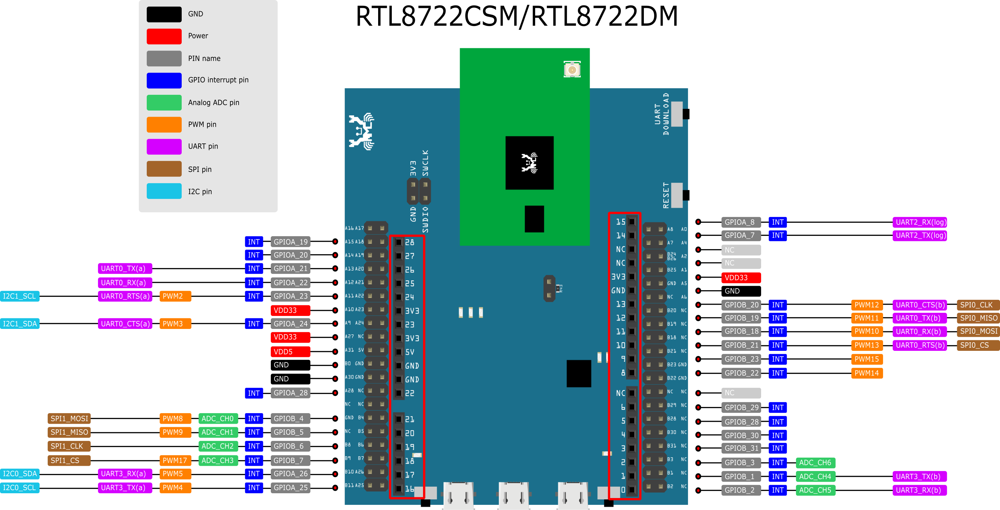

================================================
Ameba ARDUINO: Getting Started with RTL8722DM
================================================

Required Environment
====================

AmebaD RTL8722CSM/RTL8722DM currently supports Windows XP/7/8/10 32-bits
and 64-bits, Linux and Mac operating systems. In this documentation,
please use Arduino IDE with version 1.8.12 or later.

Introduction to AmebaD RTL8722CSM/RTL8722DM
===========================================

Ameba is an easy-to-program platform for developing all kind of IoT
applications. AmebaD is equipped with various peripheral interfaces,
including WiFi, GPIO INT, I2C, UART, SPI, PWM, ADC. Through these
interfaces, AmebaD can connect with electronic components such as LED,
switches, manometer, hygrometer, PM2.5 dust sensors, …etc.

The collected data can be uploaded via WiFi and be utilized by
applications on smart devices to realize IoT implementation.

|ambd-get-start-1|

AmebaD and Arduino Uno have similar size, as shown in the above
figure, and the pins on AmebaD are compatible with Arduino Uno. AmebaD 
uses Micro USB to supply power, which is common in many smart devices.

Please refer to the following figure and table for the pin diagram and
function of AmebaD.

|ambd-get-start-2|

=====  ========  ========  ==== ===== ============== ========= ========
INDEX  PIN name  GPIO INT  ADC  PWM   UART           SPI       I2C
=====  ========  ========  ==== ===== ============== ========= ========
D00    GPIOB_2   ✓         ADC5       UART3_RX(b)                      
D01    GPIOB_1   ✓         ADC4       UART3_TX(b)                      
D02    GPIOB_3   ✓         ADC6                                        
D03    GPIOB_31  ✓                                                     
D04    GPIOB_30  ✓                                                     
D05    GPIOB_28  ✓                                                     
D06    GPIOB_29  ✓                                                     
D07    NC                                                              
D08    GPIOB_22  ✓              PWM14                                  
D09    GPIOB_23  ✓              PWM15                                  
D10    GPIOB_21  ✓              PWM13 UART0_RTS(b)   SPI0_CS           
D11    GPIOB_18  ✓              PWM10 UART0_RX(b)    SPI0_MOSI         
D12    GPIOB_19  ✓              PWM11 UART0_TX(b)    SPI0_MISO         
D13    GPIOB_20  ✓              PWM12 UART0_CTS(b)   SPI0_CLK          
D14    GPIOA_7   ✓                    UART2_TX(log)                    
D15    GPIOA_8   ✓                    UART2_RX(log)                    
D16    GPIOA_25  ✓              PWM4  UART3_RX(a)              I2C0_SCL
D17    GPIOA_26  ✓              PWM5  UART3_TX(a)              I2C0_SDA
D18    GPIOB_7   ✓         ADC3 PWM17                SPI1_CS           
D19    GPIOB_6   ✓         ADC2                      SPI1_CLK          
D20    GPIOB_5   ✓         ADC1 PWM9                 SPI1_MISO         
D21    GPIOB_4   ✓         ADC0 PWM8                 SPI1_MOSI         
D22    GPIOA_28  ✓                                                     
D23    GPIOA_24  ✓              PWM3  UART0_CTS(a)             I2C1_SDA
D24    GPIOA_23  ✓              PWM2  UART0_RTS(a)             I2C1_SCL
D25    GPIOA_22  ✓                    UART0_RX(a)                      
D26    GPIOA_21  ✓                    UART0_TX(a)                      
D27    GPIOA_20  ✓                                                     
D28    GPIOA_19  ✓                                                     
=====  ========  ========  ==== ===== ============== ========= ========

|ambd-get-start-3|

Setting up Development Environment
===================================

Step 1. Installing the Driver 
-----------------------------

First, connect AmebaD to the computer via Micro USB:

|ambd-get-start-4|

If this is the first time you connect AmebaD to your computer, the USB
driver for AmebaD will be automatic installed.

You can check the COM port number in Device Manager of your computer:

|ambd-get-start-5|

Step 2. Set up Arduino IDE
--------------------------

From version 1.6.5, Arduino IDE supports third-party hardware.
Therefore, we can use Arduino IDE to develop applications on AmebaD,
and the examples of Arduino can run on AmebaD too. Arduino IDE can be
downloaded in the `Arduino website`_.

.. _Arduino website: https://www.arduino.cc/en/Main/Software

When the installation is finished, open Arduino IDE. To set up AmebaD
correctly in Arduino IDE, go to ``"File" -> "Preferences"``

|ambd-get-start-6|

And paste the following URL into ``"Additional Boards Manager URLs"`` field: 
``https://github.com/ambiot/ambd_arduino/raw/master/Arduino_package/package_realtek.com_amebad_index.json``

Next, go to ``"Tools" -> "Board" -> "Boards Manager"``:

|ambd-get-start-7|

The ``"Boards Manager"`` requires about 10~20 seconds to refresh all
hardware files (if the network is in bad condition, it may take longer).
Every time the new hardware is connected, we need to reopen the Board
Manager. So, we close the Boards Manager, and then open it again. Find
``"Realtek AmebaD Boards"`` in the list, click ``"Install"``, then the Arduino
IDE starts to download required files for AmebaD.

|ambd-get-start-8|

| If you are facing GitHub downloading issue, please refer to the
  following link at `Download/Software Development Kit`_. There are 3
  sections:
| 1. "AmebaD_Arduino_patch1_SDK", please select at least 1 of the SDKs.
  There are 5 latest released SDK options.
| 2. "AmebaD_Arduino_patch2_Tools", please select according to your
  operation system. There are Windows, Linux and MacOS.
| 3. "AmebaD_Arduino_Source_Code", this section is optional download
  only wants to refer the latest source code.

.. _Download/Software Development Kit: https://www.amebaiot.com.cn/en/ameba-arduino-summary/

Download the files selected, then unzip (patch1 and patch2 are
compulsory). There are "Install.doc"/"Install.pdf" for you to refer
installation steps. According to your system, please run the
installation tool in the "Offline_SDK_installation_tool" folder.

After the installation tool running successfully, you may open Arduino
IDE and proceed to ``"Tools" -> "Board" -> "Boards Manager"``. 
Try to find ``Realtek AmebaD Boards (32-bits ARM Cortex-M4 @200MHz)`` in the list,
click ``Install``, then the Arduino IDE starts to download required files 
for AmebaD.

Finally, we select AmebaD as current connected board in ``"Tools" -> "Board:"RTL8722DM/RTL8722CSM"``:

|ambd-get-start-9|

Try the First Example
======================

Step 1. Compile & Upload
--------------------------

| Arduino IDE provides many built-in examples, which can be compiled,
  uploaded and run directly on the boards. Here, we take the "Blink"
  example as the first try.
| Open "File" -> "Examples" -> "01.Basics" -> "Blink":

.. image:: ../media/getting_started/image10.png
   :alt: get-start-10
   :width: 5.20833in
   :height: 5.20833in

Arduino IDE opens a new window with the complete sample code.

.. image:: ../media/getting_started/image11.png
   :alt: get-start-11
   :width: 5.20833in
   :height: 5.20833in

Next, we compile the sample code directly; click "Sketch" ->
"Verify/Compile"

.. image:: ../media/getting_started/image12.png
   :alt: get-start-12
   :width: 5.20833in
   :height: 5.20833in

Arduino IDE prints the compiling messages in the bottom area of the IDE
window. When the compilation is finished, you will get the message
similar to the following figure:

.. image:: ../media/getting_started/image13.png
   :alt: get-start-13
   :width: 5.20833in
   :height: 5.20833in

| Afterwards, we will upload the compiled code to AmebaD.
| Please make sure AmebaD is connected to your computer, then click
  "Sketch" -> "Upload".

The Arduino IDE will compile first then upload. During the uploading
process, users are required to enter the upload mode of the board.
Arduino IDE will wait 5s for DEV board to enter the upload mode.

.. image:: ../media/getting_started/image14.png
   :alt: get-start-14
   :width: 6.25in
   :height: 6.25in

To enter the upload mode, first press and hold the UART_DOWNLOAD button,
then press the RESET button. If success, you should see a green LED
flashing on the DEV board.

.. image:: ../media/getting_started/image15.png
   :alt: get-start-15
   :width: 4.16667in
   :height: 4.16667in

Again, during the uploading procedure the IDE prints messages. Uploading
procedure takes considerably longer time (about 30 seconds to 1 minute).
When upload completed, the "Done uploading" message is printed.

.. image:: ../media/getting_started/image16.png
   :alt: get-start-16
   :width: 6.25in
   :height: 6.25in

Step 2.Run the Blink example
-----------------------------

| In each example, Arduino not only provides sample code, but also
  detailed documentation, including wiring diagram, sample code
  explanation, technical details, …etc. These examples can be directly
  used on AmebaD.
| So, we find the detailed information of the Blink example:
| https://www.arduino.cc/en/Tutorial/Blink

| In short, this example makes LED blinks, and it uses GPIO pin 08
  (refer to the pin diagram D08). Then we connect the LED and resistance
  as the following figure:
| (NOTE: In an LED, the longer pin is the positive pole, and shorter
  pin is the negative pole. So we connect the longer pin to D08, and
  connect the shorter pin to GND. In addition, please use a resister
  with suitable resistance in series between LED and GND to protect
  LED)

|ambd-get-start-17|

Finally, press the RESET button, and you can see the LED blinking.

**(End)**

-----------------------------------------------------------------------------------

.. note:: If you face any issue, please refer to the FAQ and troubleshooting page.

.. |ambd-get-start-1| image:: ../media/getting_started/image1.jpeg
   :alt: get-start-1
   :width: 4.01389in
   :height: 4.01389in
.. |ambd-get-start-2| image:: ../media/getting_started/image2.png
   :alt: get-start-2
   :width: 3.5in
   :height: 4in

.. |ambd-get-start-4| image:: ../media/getting_started/image4.png
   :alt: get-start-4
   :width: 4.29167in
   :height: 4.09167in
.. |ambd-get-start-5| image:: ../media/getting_started/image5.png
   :alt: get-start-5
   :width: 5.20833in
   :height: 5.20833in
.. |ambd-get-start-6| image:: ../media/getting_started/image6.png
   :alt: get-start-6
   :width: 5.20833in
   :height: 5.20833in
.. |ambd-get-start-7| image:: ../media/getting_started/image7.png
   :alt: get-start-7
   :width: 5.25in
   :height: 6.25in
.. |ambd-get-start-8| image:: ../media/getting_started/image8.png
   :alt: get-start-8
   :width: 6in
   :height: 4in

.. |ambd-get-start-9| image:: ../media/getting_started/image9.png
   :alt: get-start-9
   :width: 5.20833in
   :height: 5.20833in

.. |ambd-get-start-17| image:: ../media/getting_started/image17.png
   :alt: get-start-17
   :width: 6.25in
   :height: 6.25in