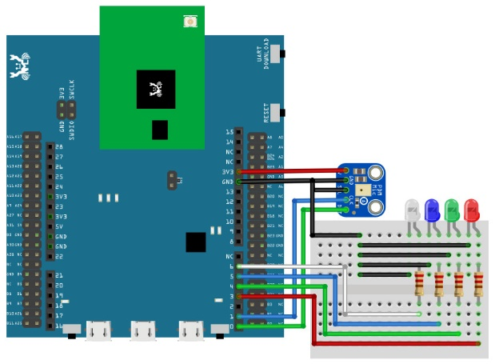
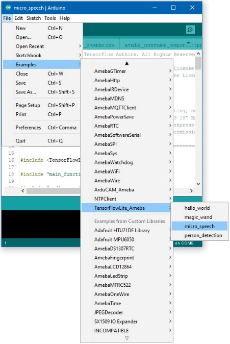

[RTL8722CSM/RTL8722DM] TensorFlow Lite - Micro Speech
=========================================================
**Materials**

-  Ameba D [RTL8722 CSM/DM] x 1

-  Adafruit PDM MEMS microphone

-  LED x 4

**Example**

**Procedure**

Connect the microphone and LEDs to the RTL8722 board following the
diagram.

Download the Ameba customized version of TensorFlow Lite for
Microcontrollers library at
https://github.com/ambiot/ambd_arduino/tree/master/Arduino_zip_libraries.
Follow the instructions at https://www.arduino.cc/en/guide/libraries to
install it. Ensure that the patch files found at
https://github.com/ambiot/ambd_arduino/tree/master/Ameba_misc/ are also
installed.

Open the example, "Files" -> "Examples" -> “TensorFlowLite_Ameba” ->
“micro_speech”.

Upload the code and press the reset button on Ameba once the upload is
finished.

Once it is running, you should see one of the LEDs flashing, indicating
that it is processing audio. Saying the word "yes" will cause the green
LED to light up. Saying the word “no” will cause the red LED to light
up. If the word is not recognized, the blue LED will to light up.

The inference results are also output to the Arduino serial monitor,
which appear as follows:

.. image:: ../media/MicroSpeech/image3.jpeg
   :width: 697
   :height: 379
   :scale: 100 %

If you are having trouble in getting the words recognized, here are some
tips:

-  Ensure that your surroundings are quiet with minimal noise.

-  Experiment with varying the distance of the microphone, starting with
   it at an arm’s length.

-  Experiment with different tones and volume when saying the words.

-  Depending on how you pronounce the words, the characteristics of the
   microphone used, getting one keyword recognized may be easier than
   the other.

**Code Reference**

More information on TensorFlow Lite for Microcontrollers can be found
at: https://www.tensorflow.org/lite/microcontrollers
