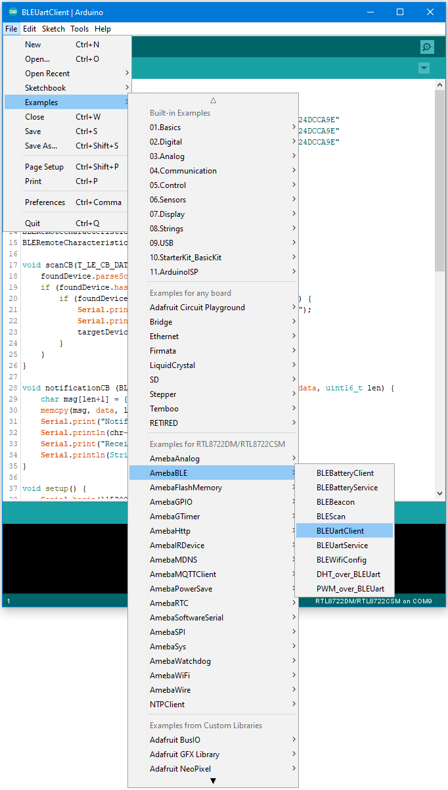

[RTL8722CSM] [RTL8722DM] BLE – BLE UART Client
===============================================
Materials

-  Ameba D [RTL8722 CSM/DM] x 1

Example

**Introduction**

In this example, two RTL8722 boards are connected using BLE. One board
runs a BLE UART service, while the other connects to the service using a
client and both boards are able to communicate with text messages over
the UART service.

**Procedure**

On the first board, upload the BLE UART service example code. Refer to
the example guide for detailed instructions.

For the second board, open the example, "Files" -> "Examples" ->
"AmebaBLE" -> "BLEUartClient".

| Upload the code and press the reset button on Ameba once the upload is
  finished.
| Reset the UART service board first, wait for the BLE advertisement
  process to begin, and reset the UART client board. The client board
  should scan, discover, and connect to the service board. After
  connecting, the client board will verify that the correct UART service
  exists on the service board, before enabling notifications on the TX
  characteristic. Any message typed in the serial terminal will be sent
  to the other board using the UART service.

.. image:: ../media/[RTL8722CSM]_[RTL8722DM]_BLE_BLE_UART_Client/image2.png
   :alt: 4
   :width: 5.20833in
   :height: 5.20833in

Code Reference

The BLEClient class is used to discover the services that exist on a
connected BLE device. The discovery process will create
BLERemoteService, BLERemoteCharacteristic and BLERemoteDescriptor
objects corresponding to the services, characteristics and descriptors
that exist on the connected device. These objects can then be used to
read and write data to the connected device.
