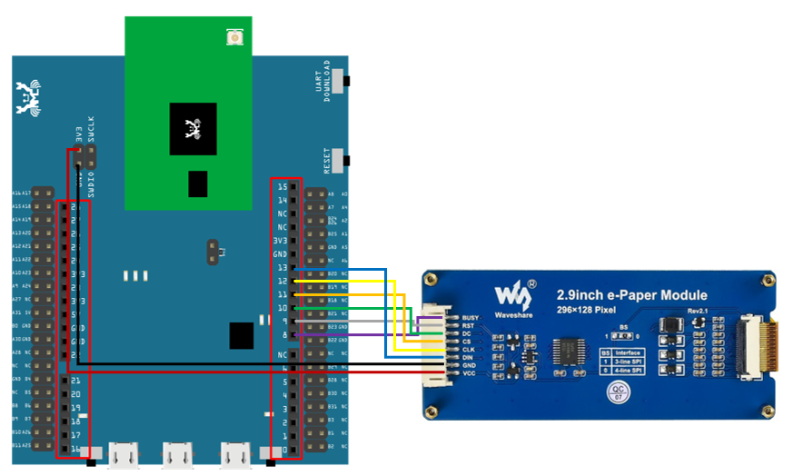

[RTL8722CSM] [RTL8722DM] Display Text On E-Paper
==================================================
Materials

-  Ameba x 1

-  Waveshare 2.9inch e-Paper HAT (D) x 1

Example

In this example, we use the Ameba RTL8722 module connects to a Waveshare
2.9inch e-Paper module to display a texts in alphanumeric. The display
uses the flexible substrate as the base plate, with interface and a
reference system design. The 2.9" active area contains 296×128 pixels
and has 1-bit white/black full display capabilities. An integrated
circuit contains gate buffer, source buffer, interface, timing control
logic, oscillator, etc… are supplied with each panel. You may refer to
the official `2.9inch e-Paper HAT (D)
datasheet <https://www.waveshare.net/w/upload/b/b5/2.9inch_e-Paper_(D)_Specification.pdf>`__ to
know more about this module. Front view of the e-Paper
Module:|1|\ RTL8722 wiring diagram:|image1|\ |image2|\ Firstly, you need
to open the "DisplayText" example in "File" -> "Examples" -> "AmebaEink"
-> "EinkDisplayText":|image3|\ Upload the code to the board and press
the Reset button after the uploading is done. You will find these texts
displayed on the board:|image4|

Code Reference

[1] We use Good Display GDEH029A1 2.9 Inch / 296×128 Resolution /
Partial Refresh Arduino Sample Code to get the e-Paper successfully
Display: http://www.good-display.com/product/201.html

.. |1| image:: ../media/[RTL8722CSM]_[RTL8722DM]_Display_Text_On_E_Paper/image1.png
   :width: 5.89583in
   :height: 7.40972in
.. |image1| image:: ../media/[RTL8722CSM]_[RTL8722DM]_Display_Text_On_E_Paper/image2.png
   :width: 6.5in
   :height: 5.64931in

.. |image3| image:: ../media/[RTL8722CSM]_[RTL8722DM]_Display_Text_On_E_Paper/image4.png
   :width: 6.5in
   :height: 5.64931in
.. |image4| image:: ../media/[RTL8722CSM]_[RTL8722DM]_Display_Text_On_E_Paper/image5.jpeg
   :width: 6.5in
   :height: 5.64931in
