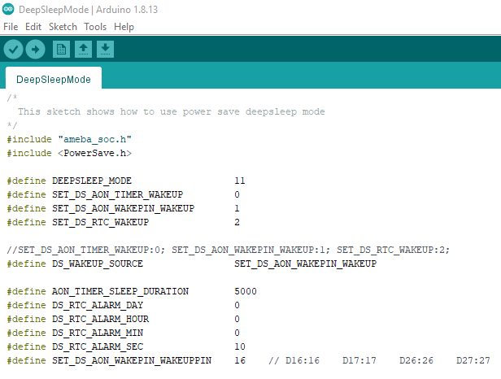
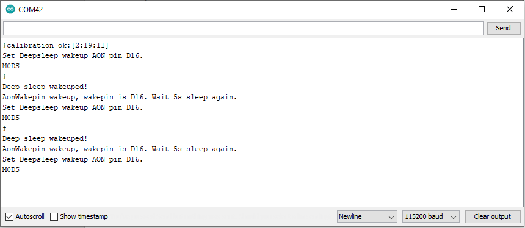

[RTL8722CSM] [RTL8722DM] Power Save Deep Sleep Mode
=====================================================
Materials

-  RTL8722DM x 1

Example

**Introduction**

Ameba-D supports two low power modes which are deepsleep mode and sleep
mode. Deepsleep mode turns off more power domain than sleep mode. The
power consumptions of DeepSleep Mode is around 7uA to 8uA compare to
normal state around 22mA. This example describes how to enter deepsleep
mode and configure wakeup source.

| **Procedure**
| Open “File” -> “Examples” -> “AmebaPowerSave” -> “DeepSleepMode”

.. image:: ../media/[RTL8722CSM]_[RTL8722DM]_Power_Save_Deep_Sleep_Mode/image1.png
   :alt: 1
   :width: 5.89583in
   :height: 7.40972in

| Set condition values as picture below.
| “DS_WAKEUP_SOURCE” is used to set the wake-up source, user can chose 3
  wake up sources now,
| AON timer (SET_DS_AON_TIMER_WAKEUP);
| AON pins (SET_DS_AON_WAKEPIN_WAKEUP);
| RTC timer (SET_DS_RTC_WAKEUP);

AON timer can be set from 0 to 32760000 range (unit ms) by
AON_TIMER_SLEEP_DURATION

There are 4 pins can be set as AON pins and active high for wake-up,
D16, D17, D26 and D27. The AON pin can be set by
SET_DS_AON_WAKEPIN_WAKEUPPIN

RTC timer wake-up system by set alarm. The alarm has 4 values, day,
hour, min and sec. All 4 values can be set by DS_RTC_ALARM_DAY,
DS_RTC_ALARM_HOUR, DS_RTC_ALARM_MIN, and DS_RTC_ALARM_SEC

When finished the condition values setting, system will run and switch
between normal and deepsleep mode controlled by wakeup source. Serial
Monitor displays the switching log.

.. image:: ../media/[RTL8722CSM]_[RTL8722DM]_Power_Save_Deep_Sleep_Mode/image3.png
   :alt: 1
   :width: 6.5in
   :height: 6.5in

.. image:: ../media/[RTL8722CSM]_[RTL8722DM]_Power_Save_Deep_Sleep_Mode/image5.png
   :alt: 1
   :width: 6.5in
   :height: 6.5in

Code Reference

Please refer to the `API
Documents <https://www.amebaiot.com/rtl8722dm-arduino-online-api-documents/>`__ PowerSave
section for detail description of all API.
