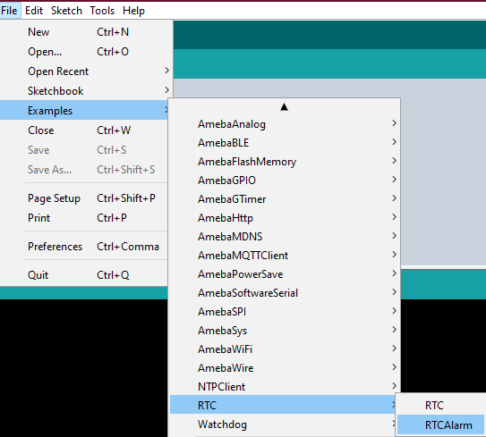

[RTL8722CSM] [RTL8722DM] Simple RTC Alarm
===========================================
Materials

-  Ameba D [RTL8722 CSM/DM] x 1

Example

This example demonstrates how to use the RTC library methods to create a
RTC Alarm, so that to do some tasks when an alarm is matched. In
particular, the RTC time is set at 16:00:00 and an alarm at 16:00:10.
When the time matches, “Alarm Match” information will be printed on the
serial monitor.

First, select the correct Ameba development board from the Arduino IDE:
“Tools” -> “Board” -> “RTL8722CSM/RTL8722DM”. Then open the ” RTCAlarm ”
example from: “File” -> “Examples” -> “RTC” -> “RTCAlarm”:

In the example, the RTC time is set at 16:00:00 and an alarm is set at
16:00:10. Upon successfully upload the sample code and press the reset
button. When the alarm time (10 seconds) is reached the attached
interrupt function will print the following information: “Alarm
Matched!” showing in this figure below.

.. image:: ../media/[RTL8722CSM]_[RTL8722DM]_Simple_RTC_Alarm/image2.png
   :alt: 1
   :width: 598
   :height: 318
   :scale: 100 %
