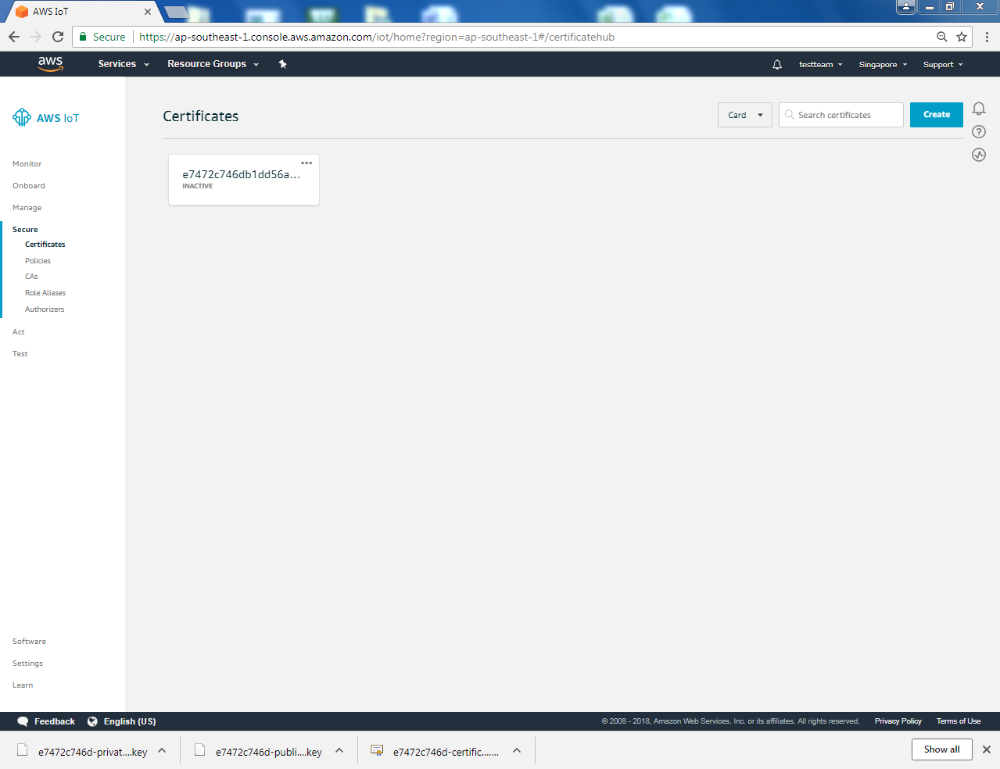
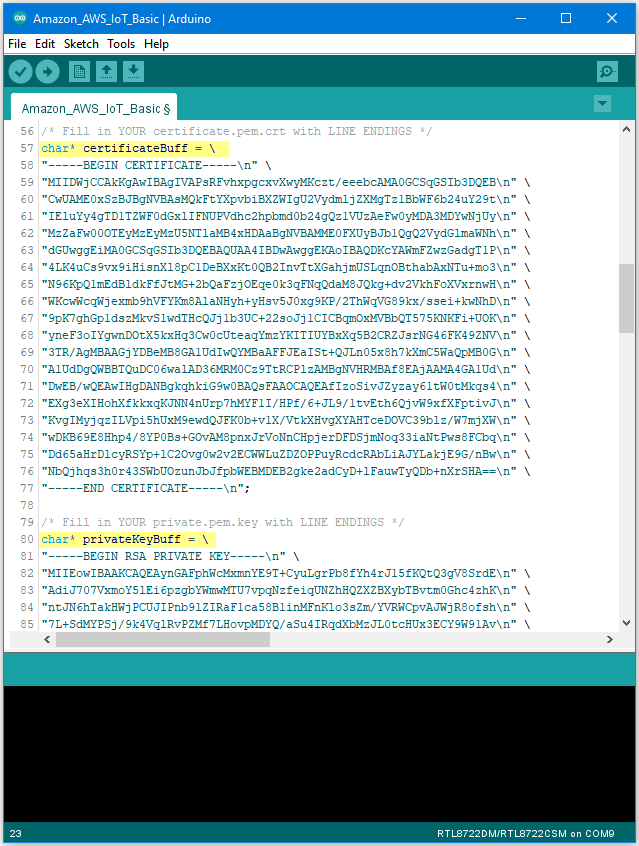

[RTL8722CSM] [RTL8722DM] Use Amazon AWS IoT Shadow Service
===========================================================
Preparation

-  Ameba x 1

Example

**Introduction**

Amazon AWS IoT is a cloud IoT service platform:

| AWS IoT is a platform that enables you to connect devices to AWS
  Services and other devices, secure data and interactions, process and
  act upon device data, and enable applications to interact with devices
  even when they are offline. (https://aws.amazon.com/iot/how-it-works/)
| The service architecture of AWS IoT:

.. image:: ../media/[RTL8722CSM]_[RTL8722DM]_Use_Amazon_AWS_IoT_Shadow_Service/image1.png
   :alt: 1
   :width: 5.89583in
   :height: 7.40972in

| (Picture
  from http://docs.aws.amazon.com/iot/latest/developerguide/aws-iot-how-it-works.html )
| In the architecture, Ameba belongs to the upper-left "Things" block. A
  TLS secure channel will be established between "Things" and the MQTT
  Message Broker. Afterwards, "Things" and "Message Broker" communicate
  using MQTT Protocol via this secure channel. Behind the "Message
  Broker", the "Thing Shadows" keeps messages temporarily when Ameba is
  offline, and sends the control message to Ameba next time it is
  connected. The "Rules Engine" allows you to place restrictions to the
  behavior of Things or to connect Things to other services of Amazon.

**AWS Management Console**

| First, create an account and sign up for AWS IoT
  service:https://aws.amazon.com/
| Afterwards, log in to the Amazon Management Console and click "IoT
  Core".
| |1|

| Then you will enter the home page of AWS IoT. To offer the best
  service quality, Amazon offers servers in different regions for users
  to choose from.
| Click the region dropdown menu at the upper-right:
| |image1|

| Choose a nearby region.
| |image2|

| Then click "Get started"
| |image3|

| Enter the main page of AWS IoT
| |image4|

.. image:: ../media/[RTL8722CSM]_[RTL8722DM]_Use_Amazon_AWS_IoT_Shadow_Service/image7.png
   :alt: 1
   :width: 5.89583in
   :height: 7.40972in

| There is a item "Things" under the field "Manage" on the left. Choose
  it and click "Register a thing"
| |image5|

| Enter next page and click "Create a single thing"
| |image6|

| We fill in "ameba" on the Name field. Attributes represent the status
  of ameba. The value of the attributes can be updated directly by ameba
  or by the control side and control side can request ameba to set the
  attribute to desired value.
| Here we add a attribute named "led" with value "0", and click "Next".
| |image7|

| Click "Create thing witohut certificate" and enter next page
| |image8|

| Then we can see that a thing named ambea was successfully created.
| |image9|

| Click field Secure "Policies" on the left and click "Create a policy"
| Policy is used to restrict the functions that a "thing" can does, it
  can limit the MQTT actions or specific topic that can be performed.
  Learn more about policy:
| http://docs.aws.amazon.com/iot/latest/developerguide/authorization.html
| |image10|

| Here we do not place policy on ameba. Fill in "amebaPolicy" in the
  Name field, "iot:*" in Action field and "*" in Resources field. Then
  check "Allow". Finally, click "Create".
| |image11|

| Finish the Policy setting:
| |image12|

| Next, we have to set up the TLS certificate. Click "Create a
  certificate". Click "Secure-> certificates" on the left and click
  "Create a certificate" on the right.
| |image13|

| You can choose to use user-defined certificate or generate a
  certificate by AWS IoT. In this example we click "1-Click certificate
  create" to generate a TLS certificate.
| |image14|

| Then, you can see 4 links. Please click each of the 4 links to
  download "public key", "private key", "certificate" and "rootCA".
| After downloading the 4 files, click "Done" and go back to
  certificates main page.
| |image15|

| Click "Attach a policy" in the "Actions" dropdown menu.
| |image16|

.. image:: ../media/[RTL8722CSM]_[RTL8722DM]_Use_Amazon_AWS_IoT_Shadow_Service/image20.png
   :alt: 1
   :width: 5.89583in
   :height: 7.40972in

| Choose "AmebaPolicy" and click "Attach"
| Then go back to the "Actions" drop-down menu at the top right of the
  certificates homepage, click on "Attach thing", select the thing
  "ameba" you just created when the window below appears, then click on
  "Attach"
| |image17|

.. image:: ../media/[RTL8722CSM]_[RTL8722DM]_Use_Amazon_AWS_IoT_Shadow_Service/image19.png
   :alt: 1
   :width: 5.89583in
   :height: 7.40972in

| Then activate the certificate. Go back to certificates main page and
  click certificate, and click "Activate" in the "Actions" dropdown
  menu.
| |image18|

| Go back to the filed on the left, choose "Manage->Things" and click
  ameba thing we created.
| |image19|

| Enter ameba thing page, choose "Interact" on the left. Find out the
  information of Rest API Endpoint to set Amazon Alexa:
| — REST API endpoint: In the value
  "https://a1a7oo4baosgyy.iot.us-east-1.amazonaws.com/things/ameba/shadow",
  the part "a1a7oo4baosgyy.iot.us-east-1.amazonaws.com" is the MQTT
  Broker server address.
| — MQTT topic:The value "$aws/things/ameba/shadow/update" represents
  the MQTT topic we will use in the AWS IoT Shadow service (if we use
  MQTT only, without AWS IoT Shadow service, then we can specify other
  topic name). It is recommended to use
  "$aws/things/ameba/shadow/update" here.

**Ameba setting**

| Open "File" -> "Examples" -> "AmebaMQTTClient" ->
  "Amazon_AWS_IoT_Basic"
| In the sample code, modify the highlighted snippet to reflect your
  WiFi network settings.
| |image20|

| Then fill in the "thing" name "ameba".
| |image21|

| And the MQTT Broker server address we found earlier in AWS IoT.
| |image22|

| Next, fill in the root CA used in TLS. Download and make sure the
  downloaded root CA contents conforms to the root CA used in the
  sketch.
| |image23|

| Next, fill in the certificate we created in the AWS IoT Console (i.e.,
  client certificate), usually its file name ends with
  "-certificate.pem.crt" (e.g., "efae24a533-certificate.pem.crt"). Open
  the certificate with a text editor, and adjust its format as follows
  to use in the sketch:
| – Add the new line character "\n" at the end of each line.
| – Add double-quote at the beginning and the end of each line.
| – To concatenate each line as a string, add "\" at the end of each
  line.
| – The last line ends with semicolon.
| Adjust the format of the private key in the same way and add it to
  privateKeyBuff.
| |image24|

**Compile and run**

| Upload the code and press the reset button on Ameba once the upload is
  finished.
| Open the serial monitor in the Arduino IDE and observe as Ameba
  connects to the AWS IoT server and sends updates on the LED state
  variable.
| |image25|

**Alternatives**

Ameba can also retrieve the current LED status variable from the AWS
shadow. This is done by sending a message to the "shadow/get" topic.
Refer to the Amazon_AWS_IoT_with_ACK example code for more information.

Code Reference

| Change led state:
| In this example, we use GPIO interface to control the led. We set
  led_pin to 10 and led_state to 1 by default in the sample code.

pinMode(led_pin, OUTPUT);

digitalWrite(led_pin, led_state);

| Set up certificate:
| Note that we use the WiFiSSLClient type of wifiClient.

WiFiSSLClient wifiClient;

| WiFiSSLClient inherits Client, so it can be passed as the parameter of
  PubSubClient constructor.
| Next, set up TLS certificate required in connection.

wifiClient.setRootCA((unsigned char*)rootCABuff);

wifiClient.setClientCertificate((unsigned char*)certificateBuff,
(unsigned char*)privateKeyBuff);

| Configure MQTT Broker server
| Then MQTT PubClient set MQTT Broker server to connect

client.setServer(mqttServer, 8883);

client.setCallback(callback);

| Connect to MQTT Broker server:
| In loop(), call reconnect() function and try to connect to MQTT Broker
  server and do the certificate verification.

while (!client.connected()) {

| Subscribe & Publish
| Next, subscribe to topics.

for (int i=0; i<5; i++) {

client.subscribe(subscribeTopic[i]);

}

| There are some common topics:
| "$aws/things/ameba/shadow/update/accepted",
| "$aws/things/ameba/shadow/update/rejected",
| "$aws/things/ameba/shadow/update/delta",
| "$aws/things/ameba/shadow/get/accepted",
| "$aws/things/ameba/shadow/get/rejected"
| Related documentation:
| http://docs.aws.amazon.com/iot/latest/developerguide/thing-shadow-data-flow.html
| Then publish current status:

sprintf(publishPayload,
"{\"state\":{\"reported\":{\"led\":%d}},\"clientToken\":\"%s\"}",
led_state, clientId);

client.publish(publishTopic, publishPayload);

| Listen to topic and make response:
| In the callback function, we listen to the 5 subscribed topics and
  check if there are messages of "/shadow/get/accepted":

if (strstr(topic, "/shadow/get/accepted") != NULL) {

If there is, the message is from the control side. If the attribute
state in the message is different from current state, publish the new
state.

updateLedState(desired_led_state);

.. |1| image:: ../media/[RTL8722CSM]_[RTL8722DM]_Use_Amazon_AWS_IoT_Shadow_Service/image2.png
   :width: 5.89583in
   :height: 7.40972in
.. |image1| image:: ../media/[RTL8722CSM]_[RTL8722DM]_Use_Amazon_AWS_IoT_Shadow_Service/image3.png
   :width: 5.89583in
   :height: 7.40972in
.. |image2| image:: ../media/[RTL8722CSM]_[RTL8722DM]_Use_Amazon_AWS_IoT_Shadow_Service/image4.png
   :width: 5.89583in
   :height: 7.40972in
.. |image3| image:: ../media/[RTL8722CSM]_[RTL8722DM]_Use_Amazon_AWS_IoT_Shadow_Service/image5.png
   :width: 5.89583in
   :height: 7.40972in
.. |image4| image:: ../media/[RTL8722CSM]_[RTL8722DM]_Use_Amazon_AWS_IoT_Shadow_Service/image6.png
   :width: 5.89583in
   :height: 7.40972in
.. |image5| image:: ../media/[RTL8722CSM]_[RTL8722DM]_Use_Amazon_AWS_IoT_Shadow_Service/image8.png
   :width: 5.89583in
   :height: 7.40972in
.. |image6| image:: ../media/[RTL8722CSM]_[RTL8722DM]_Use_Amazon_AWS_IoT_Shadow_Service/image9.png
   :width: 5.89583in
   :height: 7.40972in
.. |image7| image:: ../media/[RTL8722CSM]_[RTL8722DM]_Use_Amazon_AWS_IoT_Shadow_Service/image10.png
   :width: 5.89583in
   :height: 7.40972in
.. |image8| image:: ../media/[RTL8722CSM]_[RTL8722DM]_Use_Amazon_AWS_IoT_Shadow_Service/image11.png
   :width: 5.89583in
   :height: 7.40972in
.. |image9| image:: ../media/[RTL8722CSM]_[RTL8722DM]_Use_Amazon_AWS_IoT_Shadow_Service/image12.png
   :width: 5.89583in
   :height: 7.40972in
.. |image10| image:: ../media/[RTL8722CSM]_[RTL8722DM]_Use_Amazon_AWS_IoT_Shadow_Service/image13.png
   :width: 5.89583in
   :height: 7.40972in
.. |image11| image:: ../media/[RTL8722CSM]_[RTL8722DM]_Use_Amazon_AWS_IoT_Shadow_Service/image14.png
   :width: 5.89583in
   :height: 7.40972in
.. |image12| image:: ../media/[RTL8722CSM]_[RTL8722DM]_Use_Amazon_AWS_IoT_Shadow_Service/image15.png
   :width: 5.89583in
   :height: 7.40972in
.. |image13| image:: ../media/[RTL8722CSM]_[RTL8722DM]_Use_Amazon_AWS_IoT_Shadow_Service/image16.png
   :width: 5.89583in
   :height: 7.40972in
.. |image14| image:: ../media/[RTL8722CSM]_[RTL8722DM]_Use_Amazon_AWS_IoT_Shadow_Service/image17.png
   :width: 5.89583in
   :height: 7.40972in

.. |image16| image:: ../media/[RTL8722CSM]_[RTL8722DM]_Use_Amazon_AWS_IoT_Shadow_Service/image19.png
   :width: 5.89583in
   :height: 7.40972in
.. |image17| image:: ../media/[RTL8722CSM]_[RTL8722DM]_Use_Amazon_AWS_IoT_Shadow_Service/image21.png
   :width: 5.89583in
   :height: 7.40972in
.. |image18| image:: ../media/[RTL8722CSM]_[RTL8722DM]_Use_Amazon_AWS_IoT_Shadow_Service/image22.png
   :width: 5.89583in
   :height: 7.40972in
.. |image19| image:: ../media/[RTL8722CSM]_[RTL8722DM]_Use_Amazon_AWS_IoT_Shadow_Service/image23.png
   :width: 5.89583in
   :height: 7.40972in
.. |image20| image:: ../media/[RTL8722CSM]_[RTL8722DM]_Use_Amazon_AWS_IoT_Shadow_Service/image24.png
   :width: 5.89583in
   :height: 7.40972in
.. |image21| image:: ../media/[RTL8722CSM]_[RTL8722DM]_Use_Amazon_AWS_IoT_Shadow_Service/image25.png
   :width: 5.89583in
   :height: 7.40972in
.. |image22| image:: ../media/[RTL8722CSM]_[RTL8722DM]_Use_Amazon_AWS_IoT_Shadow_Service/image26.png
   :width: 5.89583in
   :height: 7.40972in
.. |image23| image:: ../media/[RTL8722CSM]_[RTL8722DM]_Use_Amazon_AWS_IoT_Shadow_Service/image27.png
   :width: 5.89583in
   :height: 7.40972in

.. |image25| image:: ../media/[RTL8722CSM]_[RTL8722DM]_Use_Amazon_AWS_IoT_Shadow_Service/image29.png
   :width: 5.89583in
   :height: 7.40972in
