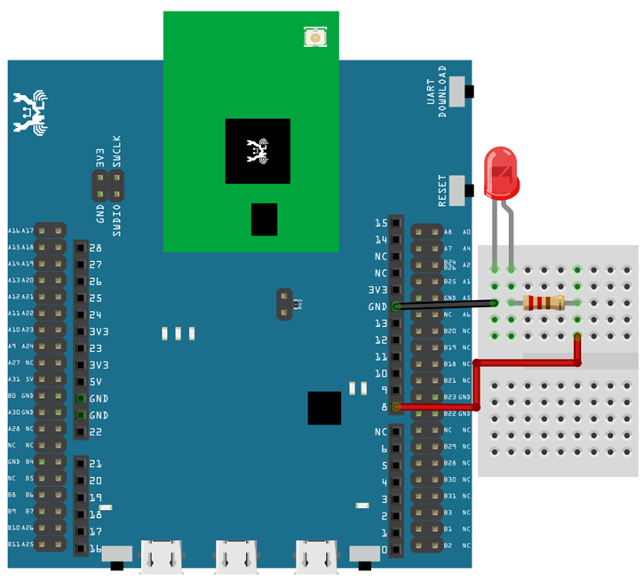

.. amebaDocs documentation master file, created by
   sphinx-quickstart on Fri Dec 18 01:57:15 2020.
   You can adapt this file completely to your liking, but it should at least
   contain the root `toctree` directive.

=============================================
[RTL8722CSM] [RTL8722DM] GPIO - Blink
=============================================

**Materials**

* Ameba x 1, LED x 1, Resistor(220ohm) x 1

**Steps**

Blink is one of the best examples to get started with MicroPython.

Let us connect pin PB_22 to the anode leg of an LED which in series with a current limiting resistor and GND to cathode of the LED as shown below,

|image1|\

Then, copy the following code and press Ctrl + e in REPL to enter the paste mode (for more information about REPL and paste mode, check “Getting started” page). If you are using Tera Term, simply right click on any blank space of the terminal and paste the code into REPL, then press Ctrl + d to execute the code. If everything is order, you should be able to see the LED blink for 3 times in 3 seconds.

.. code-block:: html
   :linenos:
   
   from machine import Pin
   a = Pin("PB_22", Pin.OUT)
   a.value(1)
   time.sleep_ms(500)
   a.value(0)
   time.sleep_ms(500)
   a.on()
   time.sleep_ms(500)
   a.off()
   time.sleep_ms(500)
   a.toggle()
   time.sleep_ms(500)
   a.toggle()

