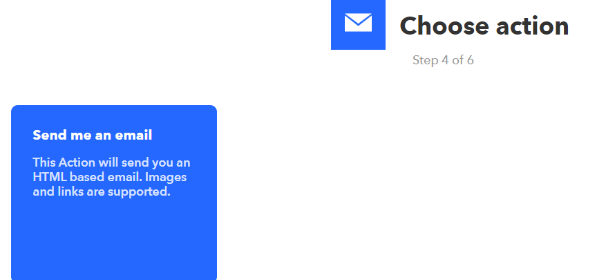

[RTL8722CSM] [RTL8722DM] Access IFTTT Via Ameba
==================================================

Introduction to IFTTT

IFTTT, known as If This Then That, is a website and mobile app and free
web-based service to create the applets, or the chains of simple
conditional statements. The applet is triggered by changes that occur
within other web services such as Gmail, Facebook, Telegram, Instagram,
Pinterest etc.

Preparation

-  Ameba x 1

-  An account from https://ifttt.com/ , in order to access IFTTT
      service\*

.. image:: ../media/[RTL8722CSM]_[RTL8722DM]_Access_IFTTT_Via_Ameba/image1.png
   :alt: 1
   :width: 6.5in
   :height: 5.43681in

\*Note: Upon log in, there are several cloud and online services that
are integrated with IFTTT platforms.

Example

-  Generate Applet from IFTTT

In next, we obtain an example of IFTTT Applet to send email to specified
recipient.

To run the example, HTTP POST feature of the ameba is used to post a
simple webhook service that is received by IFTTT Platform and in turn be
used to trigger a response (sending an email).

After logging in https://ifttt.com/, click **My Applets** from Top

.. image:: ../media/[RTL8722CSM]_[RTL8722DM]_Access_IFTTT_Via_Ameba/image2.png
   :alt: 1
   :width: 6.5in
   :height: 5.43681in

Click “New Applet” on the Applet page.

.. image:: ../media/[RTL8722CSM]_[RTL8722DM]_Access_IFTTT_Via_Ameba/image3.png
   :alt: 1
   :width: 6.5in
   :height: 5.43681in

Click +this as indicated below to add the trigger

.. image:: ../media/[RTL8722CSM]_[RTL8722DM]_Access_IFTTT_Via_Ameba/image4.png
   :alt: 1
   :width: 6.5in
   :height: 5.43681in

Choose “Webhooks” service as shown below. Alternatively, search the
service under **Choose a Service**

.. image:: ../media/[RTL8722CSM]_[RTL8722DM]_Access_IFTTT_Via_Ameba/image5.png
   :alt: 1
   :width: 6.5in
   :height: 5.43681in

Then, the available triggers will appear under service. So far, only one
Trigger, Receive a web request, is under Webhooks.

.. image:: ../media/[RTL8722CSM]_[RTL8722DM]_Access_IFTTT_Via_Ameba/image6.png
   :alt: 1
   :width: 6.5in
   :height: 5.43681in

Once **Receive a web request** is selected, an **event name** is
required to identify the trigger successfully. In this example, set
Event name as “test_event”

Next, select **That** field to create the action service taken in response to the last trigger. 
In this example, choose **Email** as the action service

.. image:: ../media/[RTL8722CSM]_[RTL8722DM]_Access_IFTTT_Via_Ameba/image7.png
   :alt: 1
   :width: 6.5in
   :height: 5.43681in

.. image:: ../media/[RTL8722CSM]_[RTL8722DM]_Access_IFTTT_Via_Ameba/image8.png
   :alt: 1
   :width: 6.5in
   :height: 5.43681in

.. image:: ../media/[RTL8722CSM]_[RTL8722DM]_Access_IFTTT_Via_Ameba/image9.png
   :alt: 1
   :width: 6.5in
   :height: 5.43681in

A list of Actions can be available under Action Service. In this
example, only Send me an Email is found. Click on Send me an Email

Under the template of **Send me an Email**, the contents os the email,
such as subject and body, is editable. Click **Create Action** to
complete action. Note that **Email** service is offered to the email
ID registered under IFTTT account.

.. image:: ../media/[RTL8722CSM]_[RTL8722DM]_Access_IFTTT_Via_Ameba/image11.png
   :alt: 1
   :width: 6.5in
   :height: 5.43681in

After Review Click on **Finish **\ to complete and create the Applet.
The applet is then found under **My Applet** in own IFTTT oage

.. image:: ../media/[RTL8722CSM]_[RTL8722DM]_Access_IFTTT_Via_Ameba/image12.png
   :alt: 1
   :width: 6.5in
   :height: 5.43681in

-  Post the Trigger via Ameba

Once the Applet is ready in the IFTTT dashboard, the example program can
be flashed onto Ameba board to post HTTP request.

1. The example program is under the folder “HTTP_IFTTT_POST”. Follow the
steps below:

1) Open the example code in “File” -> “Examples” -> “AmebaWiFi” ->
“HTTP_IFTTT_Post”

2) Once the example is opened, edit the following 3 items inside the
code to make the program work.

Edit the wi-fi credentials to connect to the wi-fi hotspot or access
point of desirable choice.

Edit the wi-fi credentials to connect to the wi-fi access point of
choice.

Under the host name field, enter the hostname of the IFTTT service
“maker.ifttt.com”

under the Path field, enter the EventName and key field
“trigger//with/key/”

− Event name: The event name should be same as the one specified in the
IFTTT applet. In this example, the event name is “test_event”

− Key: available under Webhook service in individual IFTTT account. See
next step to obtain.

3) How To obtain a key from documentation tab of the Webhooks?

find the Webhooks service in the Services tab.

.. image:: ../media/[RTL8722CSM]_[RTL8722DM]_Access_IFTTT_Via_Ameba/image13.png
   :alt: 1
   :width: 6.5in
   :height: 5.43681in

.. image:: ../media/[RTL8722CSM]_[RTL8722DM]_Access_IFTTT_Via_Ameba/image14.png
   :alt: 1
   :width: 6.5in
   :height: 5.43681in

On Webhooks service page, click on the Documentation tab on the top
right corner.

The key can found in the documentation page. Also, how HTTP request can
be used as shown

.. image:: ../media/[RTL8722CSM]_[RTL8722DM]_Access_IFTTT_Via_Ameba/image15.png
   :alt: 1
   :width: 6.5in
   :height: 5.43681in

.. image:: ../media/[RTL8722CSM]_[RTL8722DM]_Access_IFTTT_Via_Ameba/image16.png
   :alt: 1
   :width: 6.5in
   :height: 5.43681in

Once the example is ready, connect to Ameba board via USB Cable.

| Compile the code. Click on “Sketch” -> “Verify/Compile” on Arduino.
  Upon completion, “Done compiling” will be prompted at the bottom of
  Arduino.
| Upload the code onto Ameba by clicking on “Sketch” -> “Upload”.
| Once the upload is completed, “upload finish” will be reflected on the
  bottom of the Arduino IDE window
| Open the serial monitor.
| Press the “Reset” button to see the output logs.
| After the event has been successfully fired, the line of
  “Congratulations! You have fired the test_event event” can be seen on
  the serial monitor and an email reminder for this event will be
  delivered.

.. image:: ../media/[RTL8722CSM]_[RTL8722DM]_Access_IFTTT_Via_Ameba/image17.png
   :alt: 1
   :width: 6.5in
   :height: 5.43681in

.. image:: ../media/[RTL8722CSM]_[RTL8722DM]_Access_IFTTT_Via_Ameba/image18.png
   :alt: 1
   :width: 6.5in
   :height: 5.43681in

Thereafter an email is sent to recipient email account registered at
IFTTT Applet and email notification will be received.
