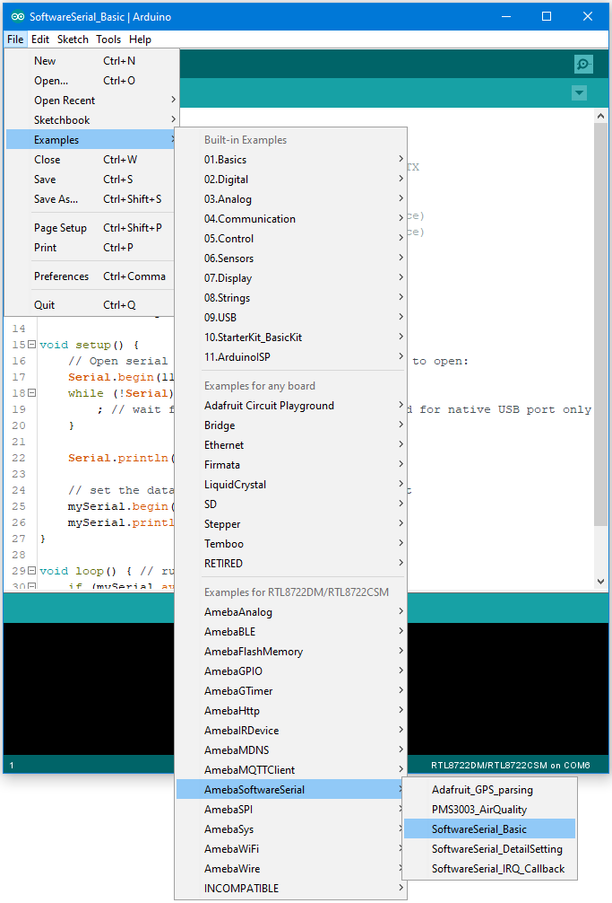
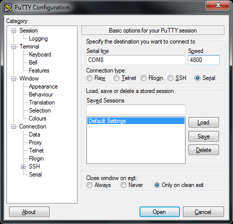
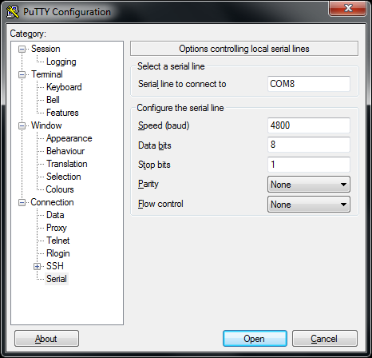
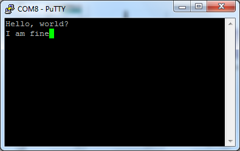

[RTL8722DM] [RTL8722DM] UART - Communicate with the computer via UART
=======================================================================
**UART 是什麽**

-  UART uses two wire, one for transmitting and the other one for
      receiving, so the data transmission is bidirectional. The
      communication uses a predefined frequency (baud rate) to transmit
      data. In Arduino, UART is called “Serial”. There is only one
      hardware UART on Arduino Uno and it is primarily used to read the
      log and messages printed by Arduino (so it is also called “Log
      UART”). If we use the hardware UART for other purposes, the Log
      UART does not have resources to function. To provide more UART
      connections, it is possible to use a GPIO pin to simulate the
      behavior of UART with a software approach, this is called Software
      Serial. Ameba is equipped with several hardware UART ports, but it
      is also compatible with the Software Serial library.

**材料準備**

-  Ameba x 1

-  USB to TTL Adapter x 1

**示例**

| In this example, we use UART to connect USB to TTL adapter to Ameba.
| USB to TTL adapter sends data to Ameba, the data would be returned by
  Ameba, and showed on the screen.

-  **Install USB to TTL Adapter**

| USB to TTL adapter converts USB to serial interface. Normally, there
  are at least 4 pins on the adapter, that is 3V3 (or 5V), GND, TX and
  RX. Generally, installing the driver for the USB to TTL adapter would
  be required before using it. If the adapter uses the chip of FTDI,
  Windows will search and install the driver automatically, otherwise,
  you may need to install corresponding driver yourself.
| Afterwards, open device manager. You can find corresponding serial
  port number of the USB to TTL adapter:

.. image:: ../media/[RTL8722CSM]_[RTL8722DM]_UART_Communicate_with_the_computer_via_UART/image1.png
   :alt: 5-1
   :width: 4.75in
   :height: 3.85417in

-  Executing the Example

Open the “SoftwareSerialExample” example in “File” -> “Examples” ->
“AmebaSoftwareSerial” -> “SoftwareSerial_Basic”:

| Connect the wire as the following diagrams show. The TX pin of USB to
  TTL adapter is connected to the RX of Ameba, and the RX pin of USB to
  TTL adapter is connected to the TX of Ameba.
| RTL8722 wiring diagram:

.. image:: ../media/[RTL8722CSM]_[RTL8722DM]_UART_Communicate_with_the_computer_via_UART/image3.png
   :alt: 5-2
   :width: 6.5in
   :height: 7.03264in

Next, open a serial port terminal, such as Putty or Tera Term. (Putty is
used in this example). Open the Putty window, choose “Serial” in
connection type, and specify the port number of the USB to TTL adapter
(e.g. COM8). In the speed field, fill in the baud rate of this
connection. Note that both sides of the connection should use the same
baud rate. In this example we set baud rate 4800.

Next, select “Serial” on the left side. Set data bits to 8, stop bits to
1, parity to none, and flow control to none.

 

Then click Open and press the reset button on Ameba. You can see the
“Hello, world?” message appears in Putty. If characters are typed into
Putty, the input characters would be sent to Serial RX of Ameba by TX of
USB to TTL Adapter, and returned by Serial TX of Ameba. Finally, RX of
USB to TTL Adapter receives the returned characters and prints them in
Putty. Therefore, if you insert “I am fine”, you will get something like
this:

Code Reference

| First, use SoftwareSerial: begin(speed) to set the baud rate for the
  serial communication:
| https://www.arduino.cc/en/Reference/SoftwareSerialBegin

Use write() to send data, and use SoftwareSerial:available() to get the
number of bytes available for reading from a software serial port:

| https://www.arduino.cc/en/Reference/SoftwareSerialAvailable
| If there are data available to read, use read() to read from serial
  port.
