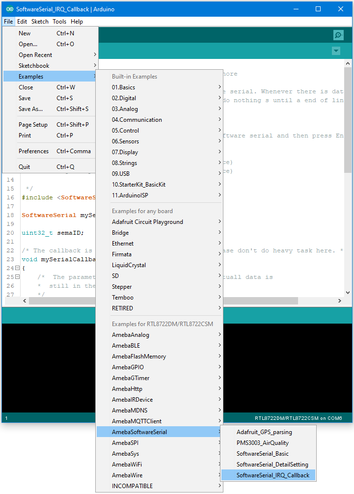

[RTL8722CSM] [RTL8722DM] UART – Set Callback Function For UART Communications
===============================================================================
Materials

-  Ameba x 1

-  USB to TTL Adapter x 1

Example

This example shows how to set a callback function for UART communication
to process the UART data.

A USB to TTL adapter is required for this example. Ensure that you have
the driver installed and connect it to the Ameba board as shown.

.. image:: ../media/[RTL8722CSM]_[RTL8722DM]_UART_Set_Callback_Function_For_UART_Communications/image1.png
   :alt: 2
   :width: 6.02778in
   :height: 3.45833in

Open the example in “File” -> “Examples” -> “AmebaSoftwareSerial” ->
“SoftwareSerial_Irq_Callback”

| Upload the code and press the reset button on Ameba once the upload is
  finished.
| Next, using a terminal program, such as TeraTerm or PuTTY, open a
  serial port and configure it according to the settings. Make sure the
  serial port number corresponds to the USB to TTL adapter.

-  Speed: 38400

-  Data: 8 bit

-  Parity: none

-  Stop bits: 1 bit

-  Flow control: none

.. image:: ../media/[RTL8722CSM]_[RTL8722DM]_UART_Set_Callback_Function_For_UART_Communications/image3.png
   :alt: 3
   :width: 6.34722in
   :height: 3.46528in

Once the serial port is open, type in the terminal and press the enter
key, and you will see the corresponding output.

.. image:: ../media/[RTL8722CSM]_[RTL8722DM]_UART_Set_Callback_Function_For_UART_Communications/image4.png
   :alt: 4
   :width: 6.5in
   :height: 4.10903in

Code Reference

mySerial.setAvailableCallback(mySerialCallback); is used to set the
function mySerialCallback as a callback function for software serial.
When a new character is received, the callback function checks if the
character corresponds to the enter key, and releases the semaphore if it
is true, which in turn allows the main loop to print out all the
previously received characters.
