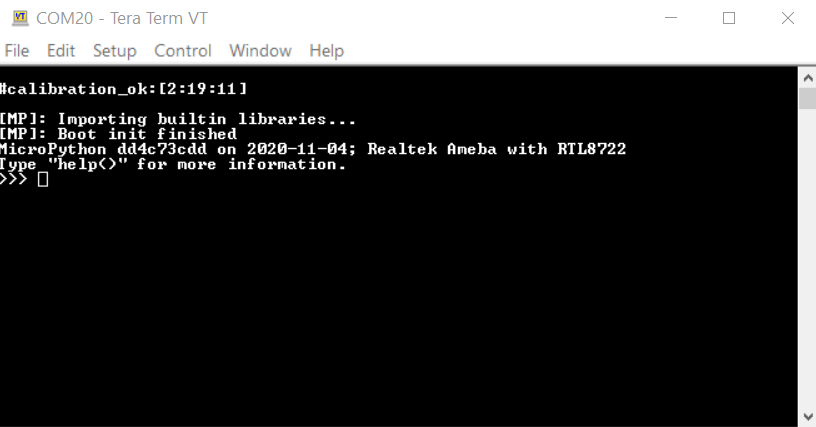

========
快速入門
========

環境配置
========

AmebaD RTL8722CSM/RTL8722DM MicroPython SDK 目前支持 Windows 10
和 Linux 操作系統。

Introduction to AmebaD RTL8722CSM/RTL8722DM
===========================================

Ameba 是一個用於開發所有類型的物聯網應用，易於編程的平台。 AmebaD 配備了包括 WiFi、GPIO INT、
I2C、UART、SPI、PWM、ADC 各種外圍接口。通過這些接口，AmebaD可以與如 LED、開關、壓力計、濕度計
PM2.5粉塵傳感器等電子元件連接。採集的數據可以通過 WiFi上傳，並被智能設備上的應用程序利用，
以實現物聯網的實施。

|get-start-1|

| AmebaD and Arduino Uno have similar size, as shown in the above
  figure, and the pins on AmebaD are compatible with Arduino Uno.
| AmebaD uses Micro USB to supply power, which is common in many smart
  devices.
| Please refer to the following figure and table for the pin diagram and
  function of AmebaD.

|get-start-2|

|  
|  

=====  ========  ========  ==== ===== ============== ========= ========
INDEX  PIN name  GPIO INT  ADC  PWM   UART           SPI       I2C
=====  ========  ========  ==== ===== ============== ========= ========
D00    GPIOB_2   ✓         ADC5       UART3_RX(b)                      
D01    GPIOB_1   ✓         ADC4       UART3_TX(b)                      
D02    GPIOB_3   ✓         ADC6                                        
D03    GPIOB_31  ✓                                                     
D04    GPIOB_30  ✓                                                     
D05    GPIOB_28  ✓                                                     
D06    GPIOB_29  ✓                                                     
D07    NC                                                              
D08    GPIOB_22  ✓              PWM14                                  
D09    GPIOB_23  ✓              PWM15                                  
D10    GPIOB_21  ✓              PWM13 UART0_RTS(b)   SPI0_CS           
D11    GPIOB_18  ✓              PWM10 UART0_RX(b)    SPI0_MOSI         
D12    GPIOB_19  ✓              PWM11 UART0_TX(b)    SPI0_MISO         
D13    GPIOB_20  ✓              PWM12 UART0_CTS(b)   SPI0_CLK          
D14    GPIOA_7   ✓                    UART2_TX(log)                    
D15    GPIOA_8   ✓                    UART2_RX(log)                    
D16    GPIOA_25  ✓              PWM4  UART3_RX(a)              I2C0_SCL
D17    GPIOA_26  ✓              PWM5  UART3_TX(a)              I2C0_SDA
D18    GPIOB_7   ✓         ADC3 PWM17                SPI1_CS           
D19    GPIOB_6   ✓         ADC2                      SPI1_CLK          
D20    GPIOB_5   ✓         ADC1 PWM9                 SPI1_MISO         
D21    GPIOB_4   ✓         ADC0 PWM8                 SPI1_MOSI         
D22    GPIOA_28  ✓                                                     
D23    GPIOA_24  ✓              PWM3  UART0_CTS(a)             I2C1_SDA
D24    GPIOA_23  ✓              PWM2  UART0_RTS(a)             I2C1_SCL
D25    GPIOA_22  ✓                    UART0_RX(a)                      
D26    GPIOA_21  ✓                    UART0_TX(a)                      
D27    GPIOA_20  ✓                                                     
D28    GPIOA_19  ✓                                                     
=====  ========  ========  ==== ===== ============== ========= ========

|  
|  

| |get-start-3|
|  

**Note:** Not all sets of peripherals shown on the picture/table above
are available on MicroPython, please refer to “\ **Peripheral Example
and API**\ ” section for more information.

Introduction to RTL8722 MicroPython port
========================================

Background Information
----------------------

MicroPython, by definition, is a lean and efficient Python3 compiler and
runtime specially designed for microcontrollers.

MicroPython distinguishes itself from other compilation-based platforms
(Arduino etc.) with its powerful method of real-time interaction to
Microcontroller through a built-in feature -- REPL.

REPL stands for Read-Evaluation-Print-Loop, it is an interactive prompt
that you can use to access and control your microcontroller.

REPL has been equipped with other powerful features such as tab
completion, line editing, auto-indentation, input history and more. It
basically functions like the classic Python IDLE but running on
microcontroller.

To use REPL, simply open any serial terminal software (most common ones
are teraterm, putty etc.) on your PC and connect to your
microcontroller's serial port, then set baudrate to 115200 before
manually reset the board, then you will see >>> MicroPython prompt
appear on the terminal. Now you may type in any Python script on REPL as
long as it's support by MicroPython and your microcontroller's
MicroPython port.

Most importantly, try to abuse "help()" function as much as possible to
gain more information. For example, upon microcontroller power up and
REPL shown, just type

>>> help()

You will see a help page giving you more details about this port; also
if you type

>>> help(modules)

it will list out all available builtin modules that are at your disposal

Furthermore, if you want to learn more about a module, such as its API
and CONSTANT available, simply type the following code and details of
that module will be returned to you,

>>> help(the module of your interest)

Let's take Pin module (GPIO) as an example:

>>> help(Pin)
object <class 'Pin'> is of type type
  id -- <function>
  init -- <function>
  value -- <function>
  off -- <function>
  on -- <function>
  toggle -- <function>
  board -- <class 'board'>
  IN -- 0
  OUT -- 1
  PULL_NONE -- 0
  PULL_UP -- 1
  PULL_DOWN -- 2

REPL Hotkeys
------------

-  Ctrl + d :

Soft reboot MicroPython will perform software reboot, this is useful
when your microcontroller is behaving abnormally. This will also run
scripts in 'boot.py' once again. Note that this will only reset the
MicroPython interpreter not the hardware, all your previously configured
hardware will stay the way it is until you manually hard-reset the
board.

-  Ctrl + e :

Paste mode Paste mode allow you to perform pasting a large trunk of code
into REPL at once without executing code line by line. This is useful
when you have found a MicroPython library and wish to test it out
immediately by copy and paste

-  Ctrl + b :

Normal mode This hotkey will set REPL back to normal mode. This is
useful if you are stuck in certain mode and can not get out.

-  Ctrl + c :

Quick cancel This hotkey help you to cancel any input and return a new
line

Setting up Development Environment
==================================

Step 1. Installing the Driver
-----------------------------

First, connect AmebaD to the computer via Micro USB:

|get-start-4|

| If this is the first time you connect AmebaD to your computer, the USB
  driver for AmebaD will be automatic installed.
| You can check the COM port number in Device Manager of your computer:

|get-start-5|

Step 2. Installing the necessary tools
--------------------------------------

On Windows
~~~~~~~~~~

For windows users, please install a serial terminal software to interact
with MicroPython. The most common serial terminals are **Tera Term** and
**Putty,** here we recommend using Tera Term, which can be downloaded
from internet.

For advanced developer who wish to compile MicroPython firmware from
scratch, then please be sure to install **Cygwin**, which is a
Linux-like environment running on Windows system. When selecting the
Cygwin installer, we recommend using the Cygwin 32-bit version. During
Cygwin installation, installer will prompt user if wish to install other
software, please make sure to select the GNU version of **make** from
the **Devel** category (see picture below) and pick the latest edition.

|image1|

Also, Python3 is required during firmware compilation, so be sure to
download the latest Python3 from its official website and have it added
as environment variable when asked during installation.

On Linux
~~~~~~~~

For Linux user, please install a serial terminal software of your choice
using apt-get install command. Here we recommend using **picocom** for
its lightweight.

For advanced developer interested in developing MicroPython module in C,
please make sure the GNU make of at least version 3.82 or newer and
Python3 are installed and can be found using terminal.

Upload Firmware into Ameba
==========================

Step 1. Navigate to “Release” folder
------------------------------------

After downloading the MicroPython repository from Github, you will
notice a “Release” folder in the root directory of this repository,
enter this folder and locate a tool named “Double-Click-Me-to-Upload”.

Step 2. Enter UART Download mode
--------------------------------

To do this, first press and hold the UART_DOWNLOAD button, then press
the RESET button. If success, you should see a green LED flashing on
your ameba.

|get-start-15|

Step 3. Run “Double-Click-Me-to-Upload”
---------------------------------------

As the name suggested, double click on the file to run it, follow
instructions printed on the screen to update the ameba’s serial COM port
(this is known to us during the driver installation step mentioned
above) so the uploading can be carried out successfully. Once the
uploading is successful, you will see a line of log printed on the
screen – “All images are sent successfully”

Try the First Example
=====================

Step 1. Open REPL
-----------------

|image2|

REPL stands for Read, Evaluate, Print and Loop, it is the
MicroPython’s terminal for user to control the microcontroller. REPL is
running on LOG UART, thus we need to open our serial terminal software,
in this case, Tera Term to see REPL,

Once Tera Term is opened, select “Serial” like in the picture above and
choose your ameba’s serial port using the dropdown list, after that, hit
“OK”. If your serial terminal is not configured to 115200 baud rate, now
is the time to change it to **115200** and leave the rest of settings as
default.

|image3|

Now that the serial port is connected, press the RESET button
once on your ameba and you should see the MicroPython’s welcome page as
shown below,

What happened here was that your Ameba first check its calibration data
and then boot into MicroPython’s firmware, MicroPython then run the
“boot.py” python script and imported builtin libraries.

Now, you can simply type

>>> help()

to see more information, and type

>>> help(modules)

to check all readily available libraries

Step 2. Run WiFi Scan example
-----------------------------

As most of peripherals’ examples requires additional hardware to show
the example is working, we will just use WiFi Scan example as our first
example and to see how easy it is to control WiFi using MicroPython.

Now, please follow along by copy+paste the following code or manually
typing them out into Tera Term and hit “Enter”

>>> from wireless import WLAN
>>> wifi = WLAN(mode = WLAN.STA)
>>> wifi.scan()

You should be able to see the returned result with all
discovered wireless network in your surrounding

|image4|

**(End)**

-------------------------------------------------------------------------------------------------------------------------------------

.. note:: If you face any issue, please refer to the FAQ and troubleshooting page.

.. |get-start-1| image:: ../media/getting_started/imageGS1.png
   :width: 4.00833in
   :height: 4.00833in
.. |get-start-2| image:: ../media/getting_started/imageGS2.png
   :width: 5in
   :height: 5.1in
.. |get-start-3| image:: ../media/getting_started/imageGS3.png
   :width: 6.26796in
   :height: 3.12872in
.. |get-start-4| image:: ../media/getting_started/imageGS5.png
   :width: 4.79167in
   :height: 3.41667in
.. |get-start-5| image:: ../media/getting_started/imageGS6.png
   :width: 5.20751in
   :height: 3.61364in
.. |image1| image:: ../media/getting_started/imageGS7.png
   :width: 6.24242in
   :height: 3.54171in
.. |get-start-15| image:: ../media/getting_started/imageGS8.png
   :width: 6.26806in
   :height: 6.43611in
.. |image2| image:: ../media/getting_started/imageGS9.png
   :width: 6.26806in
   :height: 3.26736in

.. |image4| image:: ../media/getting_started/imageGS11.png
   :width: 6.26806in
   :height: 3.60764in
