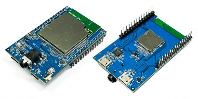

.. amebaDocs documentation master file, created by
   sphinx-quickstart on Fri Dec 18 01:57:15 2020.
   You can adapt this file completely to your liking, but it should at least
   contain the root `toctree` directive.

############################
AMB23 (RTL8722DM MINI)
############################

Welcome to AMB23 Arduino online documentation.

|image1|

.. toctree::
   :maxdepth: 1
   :caption: Table of Contents
   
   getting_started/ambd_mini_getting_started
   peripherals_and_examples/index
   release_history/Release_History
   board_hdk/index
   api_documents/index
   resources/index
   support/index  

