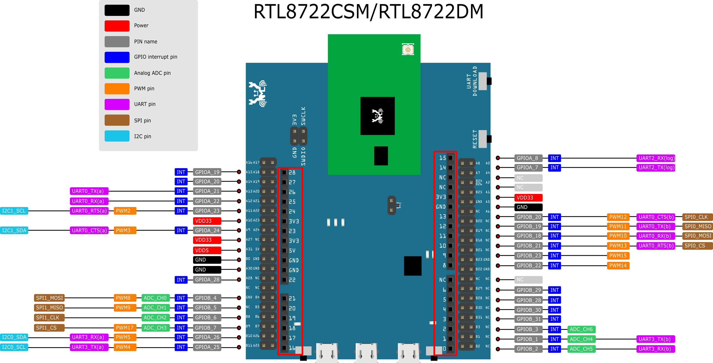
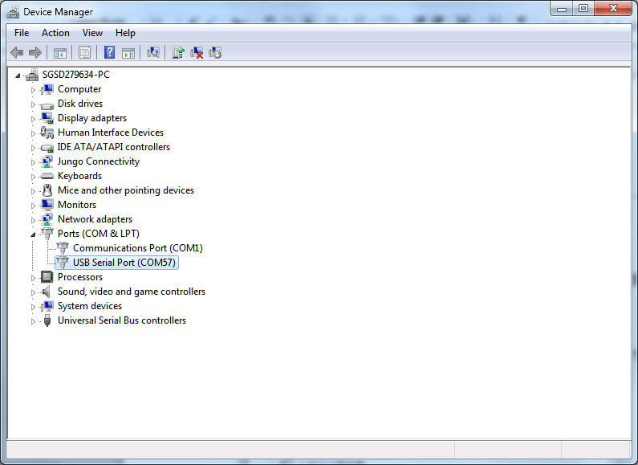
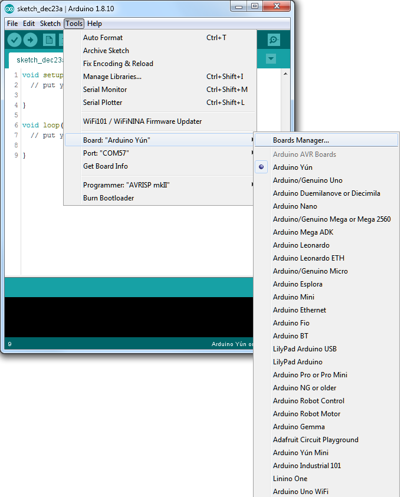
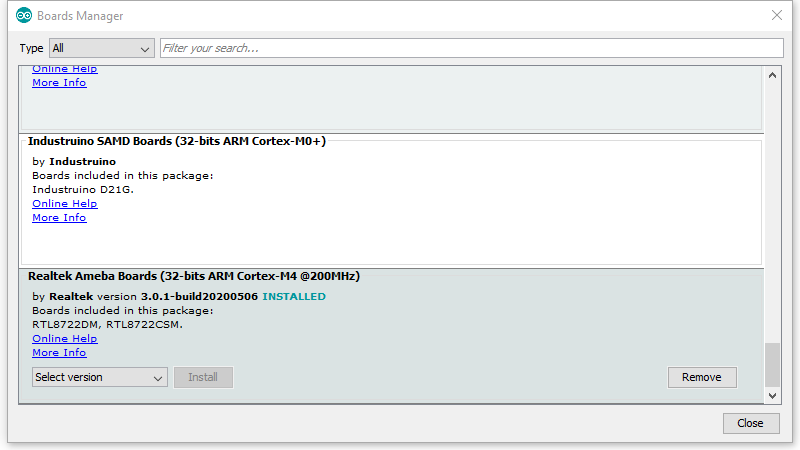
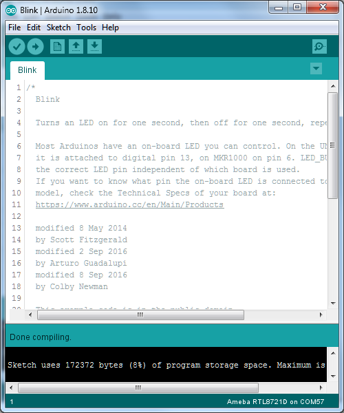
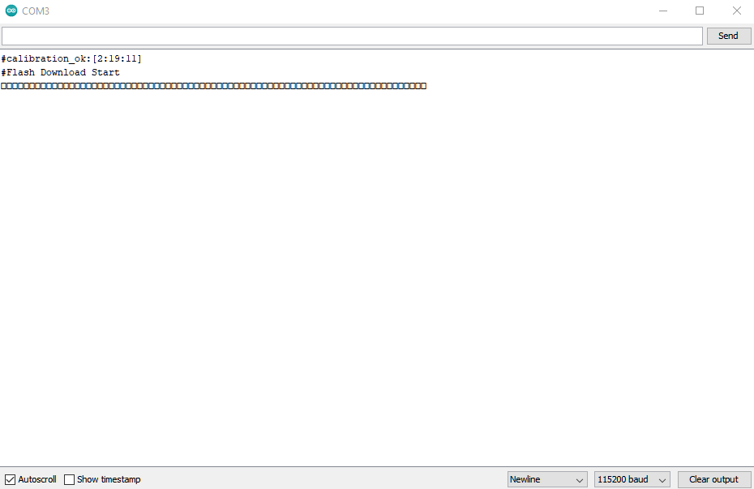
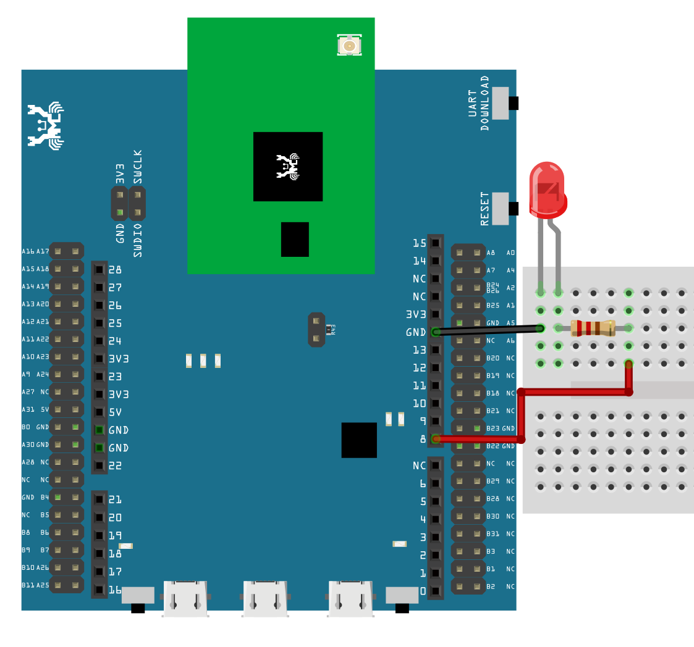
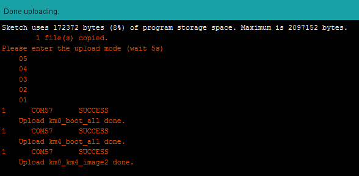

###############
Getting Started
###############

*******************************************
Ameba ARDUINO: Getting Started with RTL8722
*******************************************

Required Environment
====================

AmebaD RTL8722DM board currently supports Windows OS 32-bits and 64-bits (WIN7/8/10), 
Linux OS (Ubuntu 18 LTS/20 LTS/latest) and macOS operating systems. Please use the latest 
OS version to have the best experiences. In this documentation, please use the latest 
version Arduino IDE (at least version 1.8.12).

Introduction to AmebaD RTL8722CSM/RTL8722DM
===========================================

Ameba is an easy-to-program platform for developing all kind of IoT applications. AmebaD 
is equipped with various peripheral interfaces, including WiFi, GPIO INT, I2C, UART, SPI, 
PWM, ADC. Through these interfaces, AmebaD can connect with electronic components such as 
LED, switches, manometer, hygrometer, PM2.5 dust sensors, …etc.

The collected data can be uploaded via WiFi and be utilized by applications on smart devices 
to realize IoT implementation.

|ambd-get-start-1|

| RTL8722DM and Arduino Uno have similar size, as shown in the above
  figure, and the pins on RTL8722DM are compatible with Arduino Uno. 
| RTL8722DM uses Micro USB to supply power, which is common in many smart devices.
| Please refer to the following figure and table for the pin diagram and function of RTL8722DM.

|ambd-get-start-2|

===  ========  ====  ==== ===== ============== ========= ========
\#   PIN name  GPIO  ADC  PWM   UART           SPI       I2C
===  ========  ====  ==== ===== ============== ========= ========
D00  GPIOB_2   ✓     ADC5       UART3_RX(b)              
D01  GPIOB_1   ✓     ADC4       UART3_TX(b)              
D02  GPIOB_3   ✓     ADC6                                
D03  GPIOB_31  ✓                                            
D04  GPIOB_30  ✓                                            
D05  GPIOB_28  ✓                                            
D06  GPIOB_29  ✓                                            
D07  NC                                                    
D08  GPIOB_22  ✓          PWM14                          
D09  GPIOB_23  ✓          PWM15                          
D10  GPIOB_21  ✓          PWM13 UART0_RTS(b)   SPI0_CS    
D11  GPIOB_18  ✓          PWM10 UART0_RX(b)    SPI0_MOSI  
D12  GPIOB_19  ✓          PWM11 UART0_TX(b)    SPI0_MISO  
D13  GPIOB_20  ✓          PWM12 UART0_CTS(b)   SPI0_CLK   
D14  GPIOA_7   ✓                UART2_TX(log)            
D15  GPIOA_8   ✓                UART2_RX(log)            
D16  GPIOA_25  ✓          PWM4  UART3_RX(a)    I2C0_SCL
D17  GPIOA_26  ✓          PWM5  UART3_TX(a)    I2C0_SDA
D18  GPIOB_7   ✓     ADC3 PWM17                SPI1_CS    
D19  GPIOB_6   ✓     ADC2                      SPI1_CLK   
D20  GPIOB_5   ✓     ADC1 PWM9                 SPI1_MISO  
D21  GPIOB_4   ✓     ADC0 PWM8                 SPI1_MOSI  
D22  GPIOA_28  ✓                                            
D23  GPIOA_24  ✓          PWM3  UART0_CTS(a)   I2C1_SDA
D24  GPIOA_23  ✓          PWM2  UART0_RTS(a)   I2C1_SCL
D25  GPIOA_22  ✓                UART0_RX(a)              
D26  GPIOA_21  ✓                UART0_TX(a)              
D27  GPIOA_20  ✓                                            
D28  GPIOA_19  ✓                                            
===  ========  ====  ==== ===== ============== ========= ========

|ambd-get-start-3|

**********************************
Setting up Development Environment
**********************************

Step 1. Installing the Driver
=============================

First, connect RTL8722DM to the computer via Micro USB:

|ambd-get-start-4|

| If this is the first time you connect RTL8722DM to your computer, the USB driver 
  for RTL8722DM will be automatic installed. 
| If you have driver issue of connect board to your computer please go to 
  `here <https://ftdichip.com/drivers/>`_ for USB driver.
| You can check the COM port number in Device Manager of your computer:

|ambd-get-start-5|

Step 2. Set up Arduino IDE
==========================

From version 1.6.5, Arduino IDE supports third-party hardware.
Therefore, we can use Arduino IDE to develop applications on RTL8722DM,
and the examples of Arduino can run on RTL8722DM too. Arduino IDE can be
downloaded in the `Arduino website <https://www.arduino.cc/en/Main/Software>`_.

When the installation is finished, open Arduino IDE. To set up RTL8722DM
correctly in Arduino IDE, go to :guilabel:`“File” -> “Preferences”`.

|ambd-get-start-6|

And paste the following URL into :guilabel:`“Additional Boards Manager URLs”` field::
      
   https://github.com/ambiot/ambd_arduino/raw/master/Arduino_package/package_realtek.com_amebad_index.json

----

Next, go to :guilabel:`“Tools” -> “Board” -> “Boards Manager”`:

|ambd-get-start-7|

The :guilabel:`“Boards Manager”` requires about 10~20 seconds to refresh all
hardware files (if the network is in bad condition, it may take longer).
Every time the new hardware is connected, we need to reopen the Board
Manager. So, we close the :guilabel:`“Boards Manager”`, and then open it again. Find
:guilabel:`“Realtek AmebaD Boards (32-bits ARM Cortex-M4 @200MHz)”` in the list,
click :guilabel:`“Install”`, then the Arduino IDE starts to download required files
for RTL8722DM.

|ambd-get-start-8|

| If you are facing GitHub downloading issue, please refer to the
  following link at `Download/Software Development Kit`_. There are 3
  sections:

      1. “AmebaD_Arduino_patch1_SDK”, please select at least 1 of the SDKs. There are 5 latest released SDK options.
      2. “AmebaD_Arduino_patch2_Tools”, please select according to your operation system. There are Windows, Linux and MacOS. 
      3. “AmebaD_Arduino_Source_Code”, this section is optional download only wants to refer the latest source code.

.. _Download/Software Development Kit: https://www.amebaiot.com.cn/en/ameba-arduino-summary/

   Download the files selected, then unzip (patch1 and patch2 are compulsory). 
   There are “Install.doc”/“Install.pdf” for you to refer installation steps. 
   According to your system, please run the installation tool in the 
   “Offline_SDK_installation_tool” folder.

   After the installation tool running successfully, you may open Arduino
   IDE and proceed to :guilabel:`“Tools” -> “Board“ -> “Boards Manager…”`. Try to find
   :guilabel:`“Realtek AmebaD Boards (32-bits ARM Cortex-M4 @200MHz)”`` in the list,
   click :guilabel:`“Install”`, then the Arduino IDE starts to download required files
   for RTL8722DM.

----

Finally, we select RTL8722DM as current connected board in 
:guilabel:`“Tools” -> “Board” -> “Ameba ARM (32-bits) Boards” ->” RTL8722DM”`：

|ambd-get-start-9|

*********************
Try the First Example
*********************

Step 1. Compile & Upload
========================

| Arduino IDE provides many built-in examples, which can be compiled,
  uploaded and run directly on the boards. Here, we take the “Blink”
  example as the first try.
| Open :guilabel:`“File” -> “Examples” -> “01.Basics” -> “Blink”`:

|ambd-get-start-10|

Arduino IDE opens a new window with the complete sample code.

|ambd-get-start-11|

Next, we compile the sample code directly; click 
:guilabel:`“Sketch” -> “Verify/Compile”`

|ambd-get-start-12|

Arduino IDE prints the compiling messages in the bottom area of the IDE
window. When the compilation is finished, you will get the message
similar to the following figure:

|ambd-get-start-13|

| Afterwards, we will upload the compiled code to RTL8722DM.
| Please make sure RTL8722DM is connected to your computer, then
  click :guilabel:`“Sketch” -> “Upload”`.

| The Arduino IDE will compile first then upload. During the uploading
  process, users are required to enter the upload mode of the board.
  Arduino IDE will wait 5s for DEV board to enter the upload mode.

|ambd-get-start-14|

To enter the upload mode, first press and hold the :guilabel:`UART_DOWNLOAD` button,
then press the :guilabel:`RESET` button. If success, you should see the LED flashing
on the DEV board.

|ambd-get-start-15|

It is optional for users to check if the board entered the upload mode. 
Open serial monitor/terminal and look for “#Flash Download Start”. 
Note, it is normal that some serial terminals may show unknown characters as following picture.

|ambd-get-start-16|

Again, during the uploading procedure the IDE prints messages. Uploading
procedure takes considerably longer time (about 30 seconds to 1 minute).
When upload completed, the “Done uploading” message is printed.

|ambd-get-start-18|

Step 2.Run the Blink example
============================

| In each example, Arduino not only provides sample code, but also
  detailed documentation, including wiring diagram, sample code
  explanation, technical details, …etc. These examples can be directly
  used on RTL8722DM.
| So, we find the detailed information of the 
  `Blink example <https://www.arduino.cc/en/Tutorial/Blink>`__.

| In short, this example makes LED blinks, and it uses GPIO pin 08
  (refer to the pin diagram ``D08``). Then we connect the LED and resistance
  as the following figure:
| （NOTE: In an LED, the longer pin is the positive pole, and shorter
  pin is the negative pole. So we connect the longer pin to ``D08``, and
  connect the shorter pin to ``GND``. In addition, please use a resister
  with suitable resistance in series between LED and GND to protect LED）

|ambd-get-start-17|

| Finally, press the :guilabel:`RESET` button, and you can see the :guilabel:`LED` blinking.

**(End)**

-----------------------------------------------------------------------------------

.. note:: 
   If you face any issue, please refer to the FAQ and Trouble shooting sections on :doc:`../../support/index` page.  

.. |ambd-get-start-1| image:: ../media/getting_started/image1.jpeg
   :alt: get-start-1
   :width: 884
   :height: 883
   :scale: 50 %

.. |ambd-get-start-2| image:: ../media/getting_started/image2.png
   :alt: get-start-2
   :width: 1100
   :height: 1124
   :scale: 50 %

.. |ambd-get-start-4| image:: ../media/getting_started/image4.png
   :alt: get-start-4
   :width: 820
   :height: 584
   :scale: 50 %

.. |ambd-get-start-6| image:: ../media/getting_started/image6.png
   :alt: get-start-6
   :width: 500
   :height: 600
   :scale: 100 %

.. |ambd-get-start-9| image:: ../media/getting_started/image9.png
   :alt: get-start-9
   :width: 697
   :height: 767
   :scale: 100 %

.. |ambd-get-start-10| image:: ../media/getting_started/image10.png
   :alt: get-start-10
   :width: 570
   :height: 692
   :scale: 100 %

.. |ambd-get-start-11| image:: ../media/getting_started/image11.png
   :alt: get-start-11
   :width: 500
   :height: 600
   :scale: 100 %

.. |ambd-get-start-12| image:: ../media/getting_started/image12.png
   :alt: get-start-12
   :width: 500
   :height: 600
   :scale: 100 %

.. |ambd-get-start-14| image:: ../media/getting_started/image14.png
   :alt: get-start-14
   :width: 628
   :height: 175
   :scale: 100 %

.. |ambd-get-start-15| image:: ../media/getting_started/image15.png
   :alt: get-start-15
   :width: 732
   :height: 752
   :scale: 50 %

