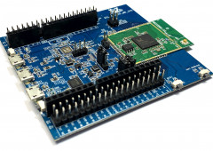

.. amebaDocs documentation master file, created by
   sphinx-quickstart on Fri Dec 18 01:57:15 2020.
   You can adapt this file completely to your liking, but it should at least
   contain the root `toctree` directive.

###############
Ameba RTL8722DM
###############

Welcome to Ameba RTL8722DM Arduino online documentation.

|image1|

.. toctree::
   :maxdepth: 1
   :caption: Table of Contents
   
   getting_started/ambd_getting_started
   download/index
   peripherals_and_examples/index
   board_hdk/index
   api_documents/index
   resources/index
   support/index  

