###############
Getting Started
###############

**************************************************
Ameba ARDUINO: Getting Started with RTL8722DM MINI
**************************************************

Required Environment
====================

AmebaD RTL8722DM MINI board currently supports Windows OS 32-bits and 64-bits (WIN7/8/10), 
Linux OS (Ubuntu 18 LTS/20 LTS/latest) and macOS operating systems. Please use the latest 
OS version to have the best experiences. In this documentation, please use the latest 
version Arduino IDE (at least version 1.8.12).

Introduction to AmebaD RTL8722DM MINI
=====================================

Ameba is an easy-to-program platform for developing all kind of IoT applications. AmebaD 
is equipped with various peripheral interfaces, including WiFi, GPIO INT, I2C, UART, SPI, 
PWM, ADC. Through these interfaces, AmebaD can connect with electronic components such as 
LED, switches, manometer, hygrometer, PM2.5 dust sensors, …etc.

The collected data can be uploaded via WiFi and be utilized by applications on smart 
devices to realize IoT implementation.

|ambd-mini-get-start-1|

RTL8722DM MINI has smaller size than Arduino Uno, as shown in the above figure.

|ambd-mini-get-start-2|

| RTL8722DM MINI uses Micro USB to supply power, which is common in many smart devices.
| Please refer to the following figure and table for the pin diagram and function of RTL8722DM MINI.

|ambd-mini-get-start-3|

|ambd-mini-get-start-4|

=== ======== ======== === === ========== ========= ========
\#  PIN name GPIO INT ADC PWM UART       SPI       I2C
=== ======== ======== === === ========== ========= ========
D0  GPIOB_0  ✓                                     I2C0 SDA
D1  GPIOB_1  ✓        A4      Serial2_TX            
D2  GPIOB_2  ✓        A5      Serial2_RX            
D3  GPIOB_3  ✓        A6                            
D4  GPIOB_4  ✓        A0  ✓                         
D5  GPIOB_5  ✓        A1  ✓                        I2C0 SCL
D6  GPIOB_6  ✓        A2                           I2C0 SDA
D7  GPIOB_7  ✓        A3  ✓                         
D8  GPIOA_2  ✓                                      
D9  GPIOA_12 ✓            ✓   Serial2_TX SPI1_MOSI  
D10 GPIOA_13 ✓            ✓   Serial2_RX SPI1_MISO  
D11 GPIOA_14 ✓                           SPI1_CLK   
D12 GPIOA_15 ✓                           SPI1_CS    
D13 GPIOA_16 ✓                                      
D14 GPIOA_28 ✓            ✓                         
D15 GPIOA_18 ✓                Serial1_TX            
D16 GPIOA_19 ✓                Serial1_RX            
D17 GPIOA_30 ✓            ✓                         
D18 GPIOA_21 ✓                Serial1_TX            
D19 GPIOA_22 ✓                Serial1_RX            
D20 GPIOA_23 ✓            ✓                         
D21 GPIOA_24 ✓            ✓                         
D22 GPIOA_31 ✓                                     I2C0 SCL
=== ======== ======== === === ========== ========= ========

**********************************
Setting up Development Environment
**********************************

Step 1. Installing the Driver
=============================

First, connect RTL8722DM MINI to the computer via Micro USB (same as power):

|ambd-mini-get-start-2|

| If this is the first time you connect RTL8722DM MINI to your computer, 
  the USB driver for RTL8722DM MINI will be automatic installed.
| If you have driver issue of connect board to your computer please go to 
  `here <https://ftdichip.com/drivers/>`_ for USB driver.
| You can check the COM port number in Device Manager of your computer:

|ambd-mini-get-start-5|

Step 2. Set up Arduino IDE
==========================

| From version 1.6.5, Arduino IDE supports third-party hardware.
  Therefore, we can use Arduino IDE to develop applications on
  RTL8722DM MINI, and the examples of Arduino can run on RTL8722DM MINI
  too. Refer to `basic example link 
  <https://www.amebaiot.com.cn/amebad-mini-arduino-compatible-ex/>`__.

| Arduino IDE can be downloaded in the Arduino website: 
| https://www.arduino.cc/en/Main/Software
| When the installation is finished, open Arduino IDE. To set up
  RTL8722DM MINI correctly in Arduino IDE, go to :guilabel:`“File” -> “Preferences”`.

|ambd-mini-get-start-6|

And paste the following URL into :guilabel:`“Additional Boards Manager URLs”` field::
      
   https://github.com/ambiot/ambd_arduino/raw/master/Arduino_package/package_realtek.com_amebad_index.json

----

Next, go to :guilabel:`“Tools” -> “Board” -> “Boards Manager”`:

|ambd-mini-get-start-7|

The :guilabel:`“Boards Manager”` requires about 10~20 seconds to refresh all
hardware files (if the network is in bad condition, it may take longer).
Every time the new hardware is connected, we need to reopen the Board
Manager. So, we close the :guilabel:`“Boards Manager”`, and then open it again. Find
:guilabel:`“Realtek AmebaD Boards (32-bits ARM Cortex-M4 @200MHz)”` in the list,
click :guilabel:`“Install”`, then the Arduino IDE starts to download required files
for AmebaD.

|ambd-mini-get-start-8|

| If you are facing GitHub downloading issue, please refer to the
  following link at `Download/Software Development Kit`_. There are 3
  sections:
      
      1. “AmebaD_Arduino_patch1_SDK”, please select at least 1 of the SDKs. There are 5 latest released SDK options.
      2. “AmebaD_Arduino_patch2_Tools”, please select according to your operation system. There are Windows, Linux and MacOS. 
      3. “AmebaD_Arduino_Source_Code”, this section is optional download only wants to refer the latest source code.

.. _Download/Software Development Kit: https://www.amebaiot.com.cn/en/ameba-arduino-summary/

   Download the files selected, then unzip (patch1 and patch2 are compulsory). 
   There are “Install.doc”/“Install.pdf” for you to refer installation steps. 
   According to your system, please run the installation tool in the 
   “Offline_SDK_installation_tool” folder.

   After the installation tool running successfully, you may open Arduino
   IDE and proceed to :guilabel:`“Tools” -> “Board“ -> “Boards Manager…”`. Try to find
   :guilabel:`“Realtek AmebaD Boards (32-bits ARM Cortex-M4 @200MHz)”`` in the list,
   click :guilabel:`“Install”`, then the Arduino IDE starts to download required files
   for AmebaD.

----

Finally, we select AmebaD as current connected board in 
:guilabel:`“Tools” -> “Board” -> “Ameba ARM (32-bits) Boards” ->” RTL8722DM MINI”`：

|ambd-mini-get-start-9|

*********************
Try the First Example
*********************

Step 1. Compile & Upload
========================

| Arduino IDE provides many built-in examples, which can be compiled,
  uploaded and run directly on the boards. Here, we take the “Blink”
  example as the first try.
| Open :guilabel:`“File” -> “Examples” -> “01.Basics” -> “Blink”`:

|ambd-mini-get-start-10|

Arduino IDE opens a new window with the complete sample code.

|ambd-mini-get-start-11|

| There are onboard LED of TRL8722DM_MINI, the default “LED_BUILTIN” is
  blue onboard LED.
| Change “LED_BUILTIN” to “LED_B” or “LED_G” for different colour.
  Onboard LEDs options LED_B and LED_G (blue and green).

|ambd-mini-get-start-12|

Next, we compile the sample code directly; click 
:guilabel:`“Sketch” -> “Verify/Compile”`

|ambd-mini-get-start-13|

Arduino IDE prints the compiling messages in the bottom area of the IDE
window. When the compilation is finished, you will get the message
similar to the following figure:

|ambd-mini-get-start-14|

| Afterwards, we will upload the compiled code to RTL8722DM MINI.
| Please make sure RTL8722DM MINI is connected to your computer, then
  click :guilabel:`“Sketch” -> “Upload”`.

| The Arduino IDE will compile first then upload. During the uploading
  process, users are required to enter the upload mode of the board.
  Arduino IDE will wait 5s for DEV board to enter the upload mode.

|ambd-mini-get-start-15|

To enter the upload mode, first press and hold the :guilabel:`UART_DOWNLOAD` button,
then press the :guilabel:`RESET` button. If success, you should see the onboard
green LED and blue LED all turned off.

|ambd-mini-get-start-16|

It is optional for users to check if the board entered the upload mode. 
Open serial monitor/terminal and look for “#Flash Download Start”. 
Note, it is normal that some serial terminals may show unknown characters as following picture.

|ambd-mini-get-start-17|

Again, during the uploading procedure the IDE prints messages. Uploading
procedure takes considerably longer time (about 30 seconds to 1 minute).
When upload completed, the “Done uploading” message is printed.

Step 2.Run the Blink example
============================

| In each example, Arduino not only provides sample code, but also
  detailed documentation, including wiring diagram, sample code
  explanation, technical details, …etc. These examples can be directly
  used on RTL8722DM MINI.
| So, we find the detailed information of the "Blink" example:
| https://www.arduino.cc/en/Tutorial/BuiltInExamples/Blink

| In short, for RTL8722DM MINI, the example can be run on both onboard
  LEDs (green or blue) or external LED (use any GPIO pins for signal
  output).
| Finally, press the :guilabel:`RESET` button, and you can see the :guilabel:`LED` blinking.

**(End)**

-----------------------------------------------------------------------------------

.. note:: 
   If you face any issue, please refer to the FAQ and Trouble shooting sections on :doc:`../../support/index` page.  

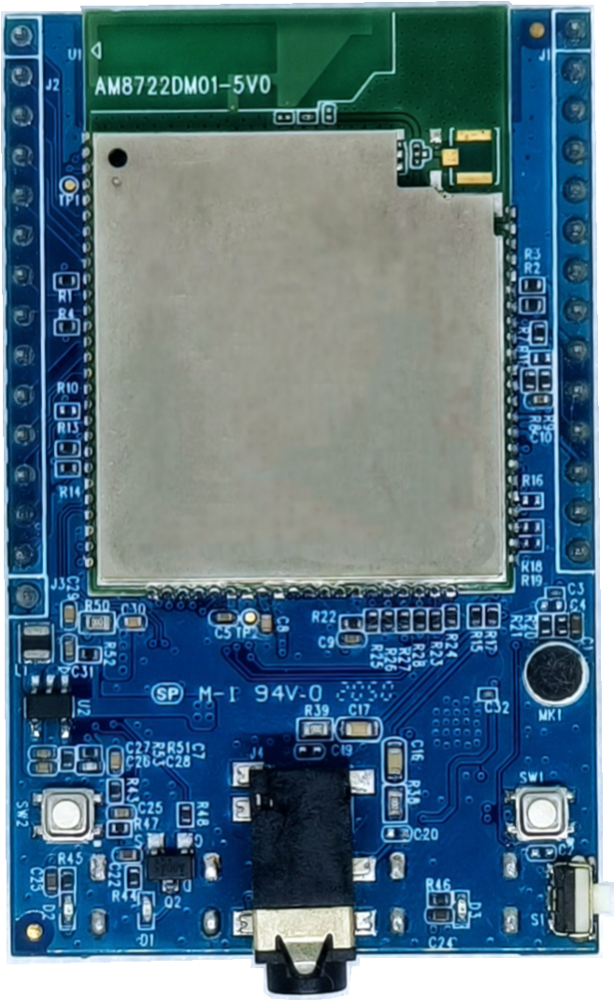

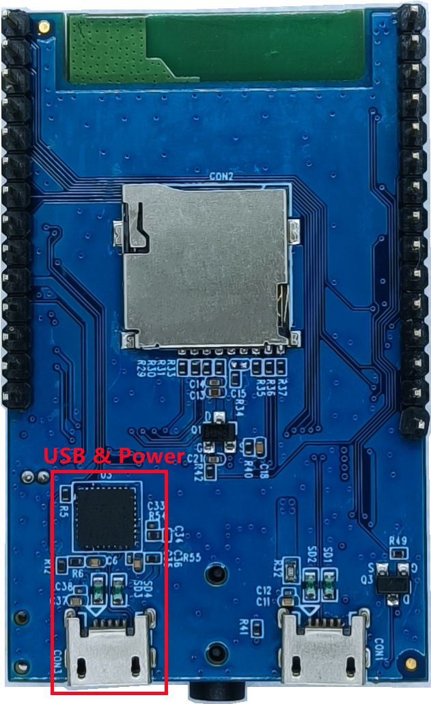

.. |ambd-mini-get-start-3| image:: ../media/GettingStarted/image3.png
   :alt: pin-diagram-front
   :width: 2103
   :height: 1089
   :scale: 35 %

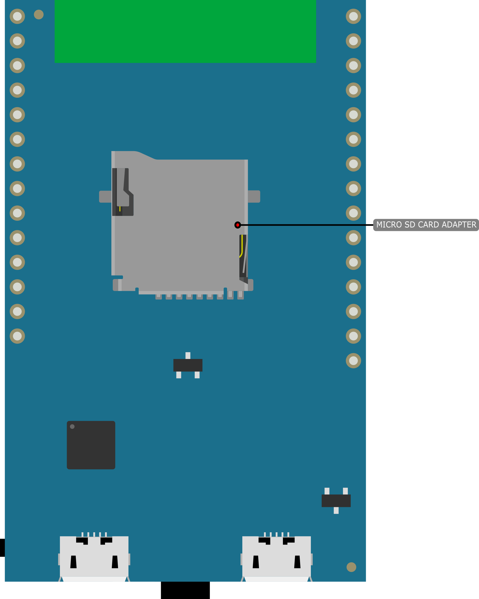

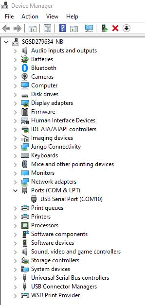

.. |ambd-mini-get-start-6| image:: ../media/GettingStarted/image5.jpeg
   :alt: get-start-6
   :width: 386
   :height: 441
   :scale: 100 %

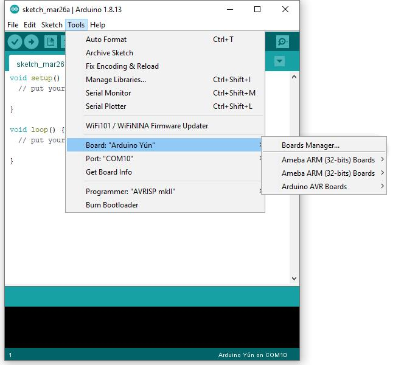

.. |ambd-mini-get-start-8| image:: ../media/GettingStarted/image7.jpeg
   :alt: get-start-8
   :width: 800
   :height: 450
   :scale: 100 %

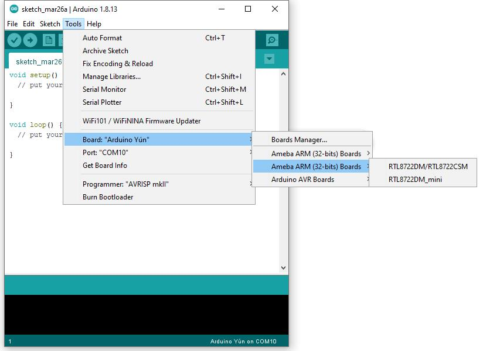

.. |ambd-mini-get-start-10| image:: ../media/GettingStarted/image9.jpeg
   :alt: get-start-10
   :width: 588
   :height: 711
   :scale: 100 %

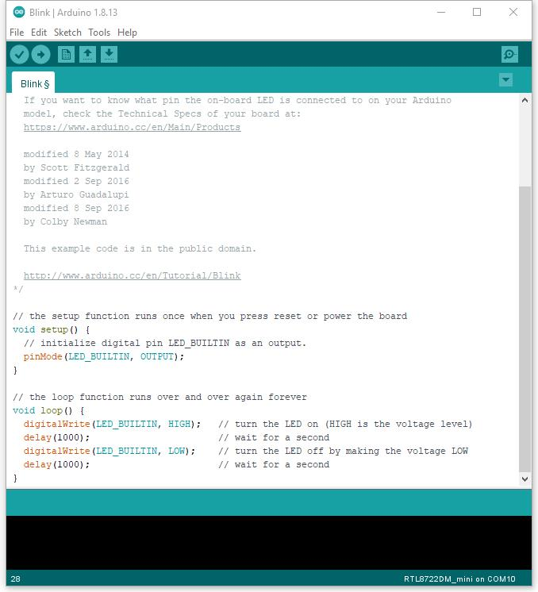

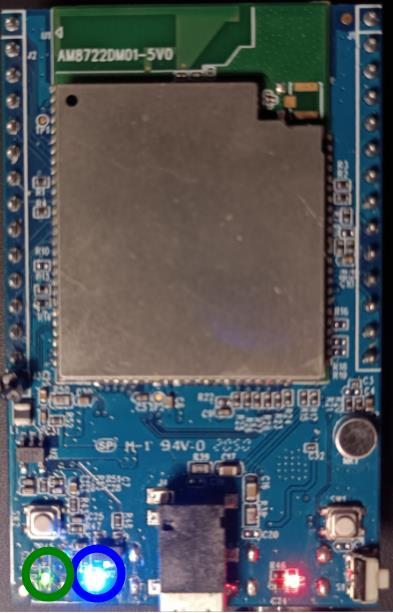

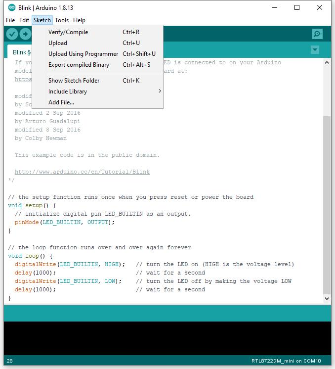

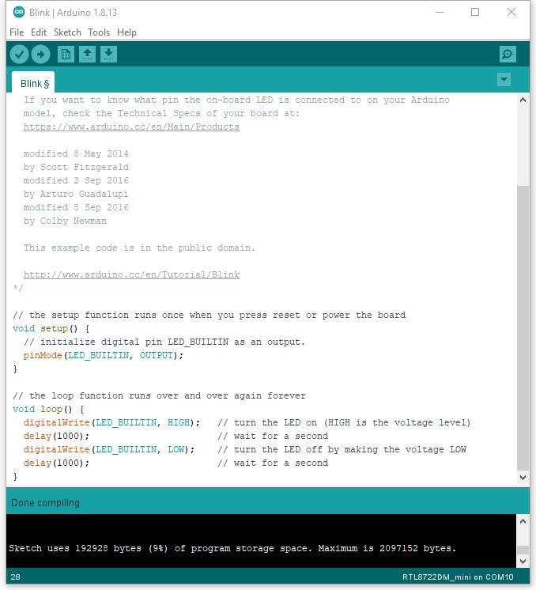

.. |ambd-mini-get-start-15| image:: ../media/GettingStarted/image14.jpeg
   :alt: get-start-15
   :width: 711
   :height: 752
   :scale: 100 %

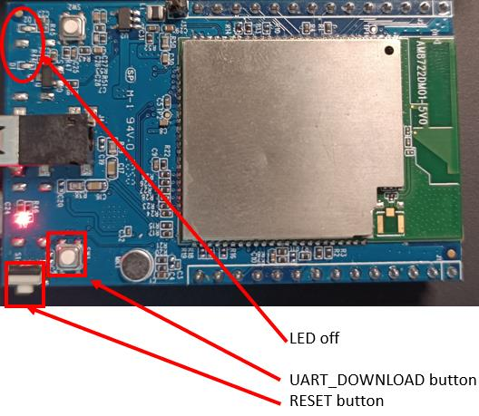

.. |ambd-mini-get-start-17| image:: ../media/GettingStarted/image16.jpeg
   :alt: get-start-17
   :width: 930
   :height: 603
   :scale: 80 %