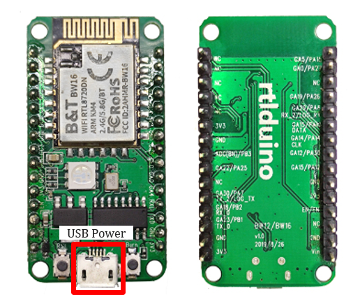
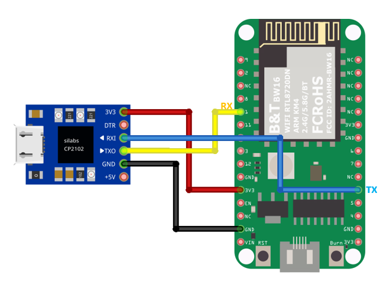
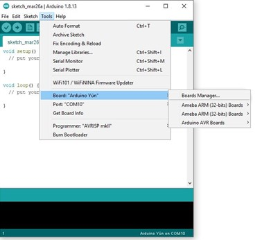
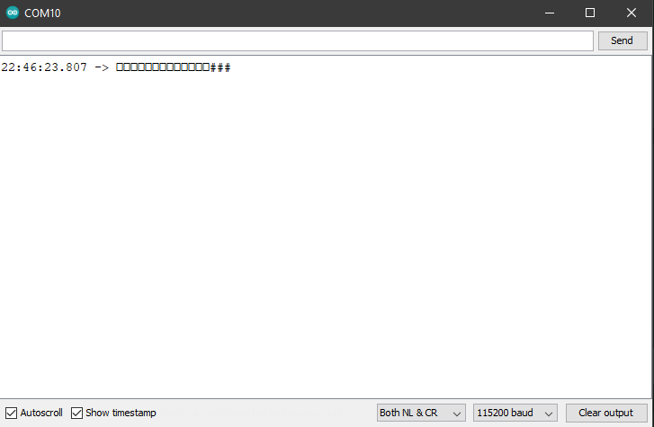
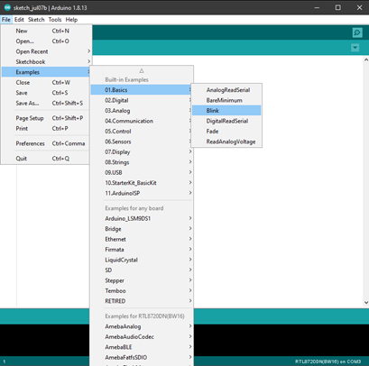
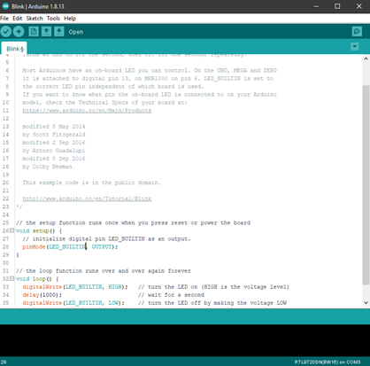
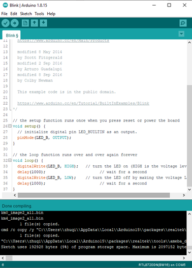
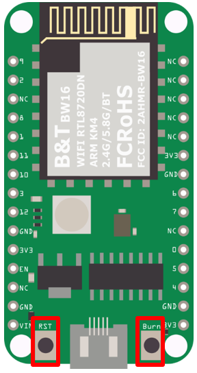

###############
Getting Started
###############

*******************************************
Ameba ARDUINO: Getting Started with BW16
*******************************************

Required Environment
====================

RTL8720DN Dual-Band Wi-Fi board currently supports Windows XP/7/8/10 32-bits and 64-bits 
operating systems. In this documentation, please use Arduino IDE with version 1.8.15 or later.

Introduction to BW16
===========================================

Realtek RTL8720DN is a Wi-Fi and Bluetooth IC that supports 2.4GHz and 5GHz dual bands for 
Wi-Fi communication, and Bluetooth Low Energy (BLE) 5.0. BW16 is a module manufactured by B&T, 
this module is a highly integrated Wi-Fi and Bluetooth module with the RTL8720DN as the main SoC 
(System on Chip), it can be regarded as an SoC for the Wi-Fi and Bluetooth application with typical SBCs.

   |bw16-get-start-1|

RTL8720DN (BW16) has a smaller size than AmebaD and AmebaD MINI as shown in the above figure. 
It uses Micro USB to supply power, which is common in many smart devices.
Please refer to the following figure and table for the pin diagram and function of RTL8720DN (BW16).

   |bw16-get-start-2|

=========  ========  ====  ==== ===== ============== ========= ========
\#         PIN name  GPIO  ADC  PWM   UART           SPI       I2C
=========  ========  ====  ==== ===== ============== ========= ========
D0(PA7)    GPIOA_7   ✓                UART_LOG_TX              
D1(PA8)    GPIOA_8   ✓                UART_LOG_RX              
D2(PA27)   GPIOA_27   ✓                                     
D3(PA30)   GPIOA_30  ✓                                            
D4(PB1)    GPIOB_1   ✓                Serial_TX                            
D5(PB2)    GPIOB_2   ✓                Serial_RX                   
D6(PB3)    GPIOB_3   ✓     A2                                       
D7(PA25)   GPIOA_25                   ✓                        I2C0_CLK
D8(PA26)   GPIOA_26  ✓          ✓                              I2C0_SDA
D9(PA15)   GPIOA_15  ✓                               SPI_CS
D10(PA14)  GPIOA_14  ✓                               SPI_CLK    
D11(PA13)  GPIOA_13  ✓          ✓                    SPI_MISO  
D12(PA12)  GPIOA_12  ✓          ✓                    SPI_MOSI  
=========  ========  ====  ==== ===== ============== ========= ========

**********************************
Setting up Development Environment
**********************************

Step 1. Installing the Driver
=============================

First, connect RTL8720DN (BW16) to the computer via Micro USB:
   |bw16-get-start-3|

| If this is the first time you connect RTL8720DN (BW16) to your computer, 
  here is something that you might take note of: 

| From the pinmap above, we know D0 and D1 pins are used for program uploading. 
  However, according to the schematic design of AI Thinker, the onboard USB-to-UART 
  module is connected to D4 and D5 which cannot be directly used for program upload.
| In order to upload firmware to this board, we suggested that you could choose to 
  add in an external USB-to-UART module connecting to D0 and D1 as shown in the 
  pin connection below:

   |bw16-get-start-4|

| Optionally, you could short the pins indicated below to use the on-board USB:
|   D1 ––– D5
|   D0 ––– D4

   |bw16-get-start-5|

| After connecting accordingly, the USB driver for RTL8720DN (BW16) will be 
  automatically installed. If you have driver issue of connecting board, please 
  go to http://www.wch-ic.com/downloads/CH341SER_ZIP.html for USB driver. 
  You can check the COM Port number in your Device Manager:
   
   |bw16-get-start-6|

Step 2. Set up Arduino IDE
==========================

From version 1.6.5, Arduino IDE supports third-party hardware.
TTherefore, we can use Arduino IDE to develop applications on RTL8720DN (BW16), 
and the basic examples of Arduino can run on RTL8720DN (BW16) too.  
Refer to the :doc:`Basic Examples </ambd_arduino/examples/basic/Basic Examples>`.

Arduino IDE can be
downloaded in the `Arduino website <https://www.arduino.cc/en/Main/Software>`_.

When the installation is finished, open Arduino IDE. To set up RTL8722DM
correctly in Arduino IDE, go to :guilabel:`“File” -> “Preferences”`.

And paste the following URL into :guilabel:`“Additional Boards Manager URLs”` field::
      
   https://github.com/ambiot/ambd_arduino/raw/master/Arduino_package/package_realtek.com_amebad_index.json

RTL8720DN (BW16) will be supported from v3.0.8 officially.

----

Next, go to :guilabel:`“Tools” -> “Board” -> “Boards Manager”`:

   |bw16-get-start-7|

The :guilabel:`“Boards Manager”` requires about 10~20 seconds to refresh all
hardware files (if the network is in bad condition, it may take longer).
Every time the new hardware is connected, we need to reopen the Board
Manager. So, we close the :guilabel:`“Boards Manager”`, and then open it again. Find
:guilabel:`“Realtek AmebaD Boards (32-bits ARM Cortex-M4 @200MHz)”` in the list,
click :guilabel:`“Install”`, then the Arduino IDE starts to download required files
for RTL8722DM.

   |bw16-get-start-8|

| If you are facing GitHub downloading issue, please refer to the
  following link at `Download/Software Development Kit`_. There are 3
  sections:

      1. “AmebaD_Arduino_patch1_SDK”, please select at least 1 of the SDKs. There are 5 latest released SDK options.
      2. “AmebaD_Arduino_patch2_Tools”, please select according to your operation system. There are Windows, Linux and MacOS. 
      3. “AmebaD_Arduino_Source_Code”, this section is optional download only wants to refer the latest source code.

.. _Download/Software Development Kit: https://www.amebaiot.com.cn/en/ameba-arduino-summary/

   Download the files selected, then unzip (patch1 and patch2 are compulsory). 
   There are “Install.doc”/“Install.pdf” for you to refer installation steps. 
   According to your system, please run the installation tool in the 
   “Offline_SDK_installation_tool” folder.

   After the installation tool running successfully, you may open Arduino
   IDE and proceed to :guilabel:`“Tools” -> “Board“ -> “Boards Manager…”`. Try to find
   :guilabel:`“Realtek AmebaD Boards (32-bits ARM Cortex-M4 @200MHz)”`` in the list,
   click :guilabel:`“Install”`, then the Arduino IDE starts to download required files
   for AmebaD.

----

Finally, we select RTL8722DM as current connected board in 
:guilabel:`“Tools” -> “Board” -> “Ameba ARM (32-bits) Boards” ->” RTL8722DM”`：

   |bw16-get-start-9|

*********************************
How to upload firmware into BW16
*********************************

| Depending on the batch of manufacturing, some BW16 modules on the development board 
  might have built-in the default B&T firmware, the firmware information is shown in 
  the image below:
| 
|   |bw16-get-start-10|
|
| This will cause Arduino Image unable to flash into the module. Although information 
  of “All images are sent successfully! Image tool closed! Upload Image did.” is 
  showing in the Image Tool, however, the factory image is unable to be erased. 
  Unfortunately after press the onboard RST button, you will find the factory image 
  still remains in the flash.

| Arduino IDE provides many built-in examples, which can be compiled,
  uploaded and run directly on the boards. Here, we take the “Blink”
  example as the first try.
| Open :guilabel:`“File” -> “Examples” -> “01.Basics” -> “Blink”`:

*********************************
Uploading Solution
*********************************

Method 1: Use AmebaD Image Tool to erase flash
===============================================

| The B&T default factory image can be washed using “Erase” function 
  provided by Realtek’s Image Tool. Using Image Tool to erase the flash 
  image memory starting from memory address: 0x8000_0000 till the end 
  of 2MB memory location, later on, we need to upload Realtek’s image 
  back to the module again using Arduino IDE.
|   |bw16-get-start-11|

Step 1 – Download and prepare the Image Tool
---------------------------------------------

| Download ambd_sdk from the link ambiot GitHub: https://github.com/ambiot/ambd_sdk.
| The Realtek’s Image Tool can be found under the following file path: 
| :guilabel:`“ambd_sdk\\tools\\AmbaD\\Image_tool\\image_tool.exe”`
| Arduino IDE opens a new window with the complete sample code.

Step 2 – Setup the Image Tool
---------------------------------------------

   1. In the “Chip Select” option, choose “AmebaD(8721D)” which is also suitable for RTL8720DN chip.
   2. Select correct COM Port that you are using.
   3. Set the Baudrate to “115200”.
   4. Then key in the Flash Erase starting position from Memory Address of 0x0800 0000.
   5. The size to be 2048 KB.
   6. Set the module to “Download mode” first, then click the “Erase” button.

|   |bw16-get-start-12|
|
| Upon finishing the above image erase and press the reset button, we could find that the 
  ``"#calibration"`` will no longer pop out, only ``"#"`` will appear in the Serial Monitor.
|   |bw16-get-start-13|

Step 3 – Download Image using Arduino IDE
---------------------------------------------

| Now you are able to download the program via UART in Ardunio IDE. In order to upload the program, 
  you could choose to either use an external USB-to-UART module connecting to D0 and D1, or short 
  the pins indicated below to use the on-board USB:
|   |bw16-get-start-5|
|   D1 ––– D5
|   D0 ––– D4

Optional Uploading Solution
===========================

OTA (Over The Air)
------------------

Ai-Thinker is providing a guide for OTA firmware upload in Section 6.1 of B&T “RTL8720D AT Command User Manual” 
of which can be retrieved from this
`link <https://docs.ai-thinker.com/_media/rtl8710/docs/rtl8720d-at%E6%8C%87%E4%BB%A4%E6%89%8B%E5%86%8Cv2.4.1-20190814.pdf>`_ here.

*********************************
Try the First Example
*********************************

Step 1. Compile & Upload
============================

| Arduino IDE provides many built-in examples, which can be compiled, uploaded, and run directly on the boards. 
| Here, we take the “Blink” example as the first try.
| Open :guilabel:`“File” -> “Examples” -> “01.Basics” -> “Blink”`:
|   |bw16-get-start-14|
| Arduino IDE opens a new window with the complete sample code.
|   |bw16-get-start-15|
| There is an onboard LED of RTL8720DN(BW16), the default ``LED_BUILTIN`` is a green onboard LED. 
  Change ``LED_BUILTIN`` to ``LED_B`` or ``LED_R`` for different colors such as blue and red. 
  Here we use ``LED_B`` for demonstration purpose.
| Next, we compile the sample code directly; click 
  :guilabel:`“Sketch” -> “Verify/Compile”`
|   |bw16-get-start-16|
| Arduino IDE prints the compiling messages in the bottom area of the IDE
  window. When the compilation is finished, you will get the message
  similar to the following figure:
|   |bw16-get-start-17|
| Afterwards, we will upload the compiled code to RTL8720DN(BW16).
|
| Please make sure RTL8720DN(BW16) is connected to your computer, then
  click :guilabel:`“Sketch” -> “Upload”`.
|
| The Arduino IDE will compile first then upload. During the uploading process, 
  users are required to enter the upload mode of the board. 
  To enter the upload mode, first press and hold the RTL8720DN(BW16) “Burn” 
  button, press the “RST” button, and then release the “Burn” button.
|   |bw16-get-start-18|
| Press “Upload” button in Arduino IDE to compile and upload the program. 
  Arduino IDE will wait for 5s for the development board to enter the upload mode.
|   |bw16-get-start-19|
| Again, during the uploading procedure the IDE prints messages. Uploading
  procedure takes considerably longer time (about 30 seconds to 1 minute).
  When upload completed, the “Done uploading” message is printed.

Step 2.Run the Blink example
============================

| In each example, Arduino not only provides sample code, but also
  detailed documentation, including wiring diagram, sample code
  explanation, technical details, …etc. These examples can be directly
  used on RTL8720DN (BW16).
| So, we find the detailed information of the 
  `Blink example <https://www.arduino.cc/en/Tutorial/Blink>`__.
|
| In short, for RTL8720DN, the example can be run on both the 
  onboard RGB LED or external LED (use any GPIO pins for signal output). 
  Finally, press the “RST” button, and you can see the RGB LED turns into blue and keep blinking.

*********************************
References
*********************************

1. Introduction of RTL8720DN on Instructable:
   https://www.instructables.com/RTL8720DN/
2. Load Arduino image into BW16:
   `How to load BW16 program with Arduino – #13 <https://forum.amebaiot.com/t/how-to-load-bw16-program-with-arduino/517/13>`_
3. RTL8720DN (BW16) IMG2 SIGN Invalid Solution:
   `RTL8720DN(BW16) IMG2 SIGN Invalid Solution <https://forum.amebaiot.com/t/rtl8720dn-bw16-img2-sign-invalid-solution/669>`_
4. FTDI Driver Download from here:
   https://ftdichip.com/wp-content/uploads/2021/02/CDM21228_Setup.zip

**(End)**

-----------------------------------------------------------------------------------

.. note:: 
   If you face any issue, please refer to the FAQ and Trouble shooting sections on :doc:`../../support/index` page.  

.. |bw16-get-start-2| image:: ../media/getting_started/image2.png
   :width: 2363
   :height: 1103
   :scale: 25 %
.. |bw16-get-start-3| image:: ../media/getting_started/image3.png
   :width: 414
   :height: 690
   :scale: 50 %

.. |bw16-get-start-5| image:: ../media/getting_started/image5.png
   :width: 795
   :height: 579
   :scale: 50 %
.. |bw16-get-start-6| image:: ../media/getting_started/image6.png
   :width: 307
   :height: 484
   :scale: 100 %

.. |bw16-get-start-8| image:: ../media/getting_started/image8.png
   :width: 800
   :height: 450
   :scale: 100 %
.. |bw16-get-start-9| image:: ../media/getting_started/image9.png
   :width: 891
   :height: 407
   :scale: 80 %
.. |bw16-get-start-10| image:: ../media/getting_started/image10.png
   :width: 481
   :height: 351
   :scale: 100 %
.. |bw16-get-start-11| image:: ../media/getting_started/image11.png
   :width: 602
   :height: 348
   :scale: 100 %
.. |bw16-get-start-12| image:: ../media/getting_started/image12.png
   :width: 517
   :height: 204
   :scale: 100 %

.. |bw16-get-start-16| image:: ../media/getting_started/image16.png
   :width: 378
   :height: 583
   :scale: 100 %

.. |bw16-get-start-19| image:: ../media/getting_started/image19.png
   :width: 351
   :height: 488
   :scale: 100 %