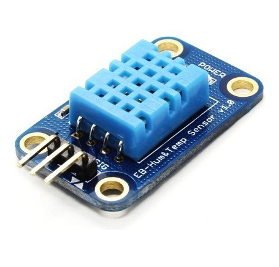

#################
Components Used
#################

.. list-table:: Components used in Examples
   :widths: 25 25 
   :header-rows: 1

   * - |image-1|
     - |image-2|
   * - | :doc:`DHT11_DHT22<../../examples/peripheral/GPIO - Measuring The Temperature And Humidity>`
       | Humidity & temperature sensor
     - | :doc:`HC_SR04<../../examples/peripheral/GPIO - Measure The Distance By Ultrasound Module>`
       | Distance measurement function

   * - |image-3|
     - |image-4|
   * - | :doc:`ILI9341 TFT LCD<../../examples/peripheral/SPI - Print Image And Text On LCD Screen>`
       | TFT LCD display with SPI interface
     - | :doc:`PMS3003/5003<../../examples/peripheral/PM2.5 Concentration In The Air>`
       | Air quality sensor that detects 
       | concentration of micro particulate matters
   
   * - |image-5|
     - |image-6|
   * - | :doc:`QVGA TFT LCD<../../examples/peripheral/SPI - Print Image And Text On LCD Screen>`
       | QVGA TFT LCD display module
     - | :doc:`Adafruit Ultimate GPS Breakout<../../examples/peripheral/UART - Retrieve GPS Position>`
       | High-quality GPS positioning module
   * - |image-7|
     -
   * - | :doc:`Tower Pro SG90<../../examples/peripheral/PWM - Using A Servo>`
       | Servo with high output power
     - 
   

.. |image-3| image:: ../../media/COMPONENT/image3.jpeg
 :width: 600
 :height: 600
 :scale: 45 %
.. |image-4| image:: ../../media/COMPONENT/image4.jpeg
 :width: 1000
 :height: 1000
 :scale: 35 %
.. |image-5| image:: ../../media/COMPONENT/image5.jpeg
 :width: 1070
 :height: 1070
 :scale: 25 %
.. |image-6| image:: ../../media/COMPONENT/image6.jpeg
 :width: 1070
 :height: 1070
 :scale: 25 %
.. |image-7| image:: ../../media/COMPONENT/image7.jpeg
 :width: 508
 :height: 400
 :scale: 50 %