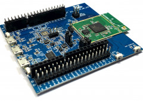

.. ambd_sdk documentation master file, created by
   sphinx-quickstart on Mon Feb  8 14:54:23 2021.
   You can adapt this file completely to your liking, but it should at least
   contain the root `toctree` directive.

##############
Standard SDK
##############

| Welcome to Ameba Standard SDK online documentation

| Ameba RTL8722DM  (AMB 21)

|image1|

.. toctree::
   :maxdepth: 1
   :caption: Contents

   getting_started/getting_started
   download/index
   board_hdk/index
   support/index   

