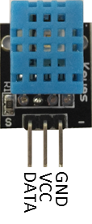

[RTL8722CSM] [RTL8722DM] GPIO - Measuring The Temperature And Humidity
=======================================================================
Preparation

-  Ameba x 1

-  DHT11 or DHT22 or DHT21

Example

| DHT11 is a temperature and humidity sensor which operates at voltage
  3.3V~5V. At room temperature, the measurable range of the humidity is
  20% ~ 90%RH with ±5%RH precision, the measurable range of the
  temperature is 0 ~ 50℃ with ±2℃ precision.
| Another choice of temperature and humidity sensor is DHT22 sensor,
  which has better precision. Its measurable range of the humidity is
  0%~100%RH with ±5%RH precision, the measurable range of the
  temperature is -40~125 ℃ with ±0.2℃ precision.
| There are 4 pins on the sensor:

.. image:: ../media/[RTL8722CSM]_[RTL8722DM]_GPIO_Measuring_The_Temperature_And_Humidity/image1.png
   :alt: 1
   :width: 2.69444in
   :height: 3.45833in

Since one of the 4 pins has no function, there are temperature/humidity
sensors with only 3 pins on the market:

DHT is normally in the sleeping mode. To get the temperature/humidity
data, please follow the steps:

1. Awake DHT: Ameba toggles low its DATA pin of GPIO. Now the DATA pin
      of GPIO serves as digital out to Ameba.

2. DHT response: DHT also toggle low its DATA pin of GPIO. Now the DATA
      pin of GPIO serves as digital in for Ameba.

3. DHT sends data: DHT sends out the temperature/humidity data (which
      has size 5 bytes) in a bit by bit manner. To represent each bit,
      DHT first pull low the DATA GPIO pin for a while and then pull
      high. If the duration of high is smaller than low, it stands for
      bit 0. Otherwise it stands for bit 1.

.. image:: ../media/[RTL8722CSM]_[RTL8722DM]_GPIO_Measuring_The_Temperature_And_Humidity/image3.png
   :alt: 3
   :width: 6.5in
   :height: 1.88889in

| RTL8722 wiring diagram:
| |4|

Open the sample code in “Files” -> “Examples” -> “AmebaGPIO” ->
“DHT_Tester”. Compile and upload to Ameba, then press the reset button.
The result would be shown on the Serial Monitor.

.. image:: ../media/[RTL8722CSM]_[RTL8722DM]_GPIO_Measuring_The_Temperature_And_Humidity/image5.png
   :alt: 5
   :width: 6.06944in
   :height: 3.47917in

Code Reference

Use dht.readHumidity() read the humidity value, and
use dht.readTemperature() to read the temperature value.

Every time we read the temperature/humidity data, Ameba uses the
buffered temperature/humidity data unless it found the data has expired
(i.e., has not been updated for over 2 seconds). If the data is expired,
Ameba issues a request to DHT to read the latest data.

.. |4| image:: ../media/[RTL8722CSM]_[RTL8722DM]_GPIO_Measuring_The_Temperature_And_Humidity/image4.png
   :width: 6.04861in
   :height: 6.29167in
