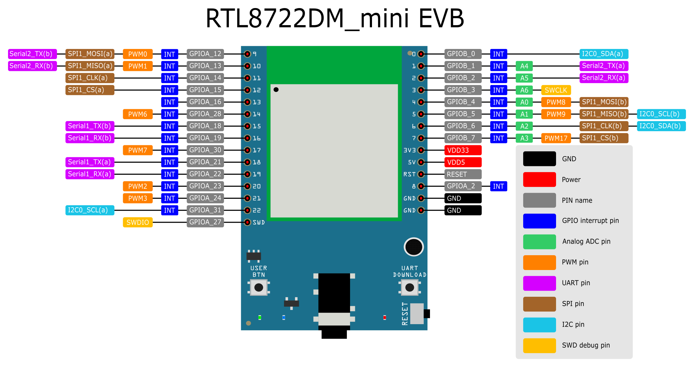
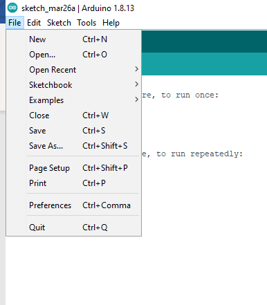
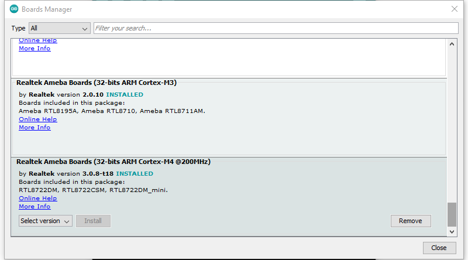
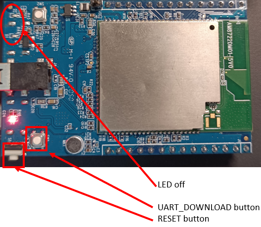

Getting Started with RTL8722DM_mini
===========================================================

Required Environment

AmebaD RTL8722DM_MINI currently supports Windows XP/7/8/10 32-bits and
64-bits, Linux and Mac operating systems. In this documentation, please
use Arduino IDE with version 1.8.12 or later.

Introduction to AmebaD RTL8722DM_MINI

Ameba is an easy-to-program platform for developing all kind of IoT
applications. AmebaD is equipped with various peripheral interfaces,
including WiFi, GPIO INT, I2C, UART, SPI, PWM, ADC. Through these
interfaces, AmebaD can connect with electronic components such as LED,
switches, manometer, hygrometer, PM2.5 dust sensors, …etc.

The collected data can be uploaded via WiFi and be utilized by
applications on smart devices to realize IoT implementation.

.. image:: ../media/RTL8722DM_mini_Arduino_SDK_getting_start/image1.jpeg
   :width: 1.76945in
   :height: 3.14583in

RTL8722DM_MINI has smaller size than Arduino Uno, as shown in the above
figure.

.. image:: ../media/RTL8722DM_mini_Arduino_SDK_getting_start/image2.png
   :width: 1.7615in
   :height: 2.91667in

RTL8722DM_MINI uses Micro USB to supply power, which is common in many
smart devices.

Please refer to the following figure and table for the pin diagram and
function of RTL8722DM_MINI.

=== ======== ======== === === ========== ========= ========
\   PIN name GPIO INT ADC PWM UART       SPI       I2C
=== ======== ======== === === ========== ========= ========
D0  GPIOB_0  ✓                                     I2C0 SDA
D1  GPIOB_1  ✓        A4      Serial2_TX           
D2  GPIOB_2  ✓        A5      Serial2_RX           
D3  GPIOB_3  ✓        A6                           
D4  GPIOB_4  ✓        A0  ✓                        
D5  GPIOB_5  ✓        A1  ✓                        I2C0 SCL
D6  GPIOB_6  ✓        A2                           I2C0 SDA
D7  GPIOB_7  ✓        A3  ✓                        
D8  GPIOA_2  ✓                                     
D9  GPIOA_12 ✓            ✓   Serial2_TX SPI1_MOSI 
D10 GPIOA_13 ✓            ✓   Serial2_RX SPI1_MISO 
D11 GPIOA_14 ✓                           SPI1_CLK  
D12 GPIOA_15 ✓                           SPI1_CS   
D13 GPIOA_16 ✓                                     
D14 GPIOA_28 ✓            ✓                        
D15 GPIOA_18 ✓                Serial1_TX           
D16 GPIOA_19 ✓                Serial1_RX           
D17 GPIOA_30 ✓            ✓                        
D18 GPIOA_21 ✓                Serial1_TX           
D19 GPIOA_22 ✓                Serial1_RX           
D20 GPIOA_23 ✓            ✓                        
D21 GPIOA_24 ✓            ✓                        
D22 GPIOA_31 ✓                                     I2C0 SCL
=== ======== ======== === === ========== ========= ========

Setting up Development Environment

Step 1. Installing the Driver

First, connect RTL8722DM_MINI to the computer via Micro USB (same as
power):

.. image:: ../media/RTL8722DM_mini_Arduino_SDK_getting_start/image2.png
   :width: 1.93136in
   :height: 3.19792in

If this is the first time you connect RTL8722DM_MINI to your computer,
the USB driver for RTL8722DM_MINI will be automatic installed.

You can check the COM port number in Device Manager of your computer:

Step 2. Set up Arduino IDE

From version 1.6.5, Arduino IDE supports third-party hardware.
Therefore, we can use Arduino IDE to develop applications on
RTL8722DM_MINI, and the examples of Arduino can run on RTL8722DM\_ MINI
too. Refer to link **basic example link**

| Arduino IDE can be downloaded in the Arduino website:
| https://www.arduino.cc/en/Main/Software

When the installation is finished, open Arduino IDE. To set up
RTL8722DM_MINI correctly in Arduino IDE, go to “File” -> “Preferences”.

And paste the following URL into “Additional Boards Manager URLs” field:

https://github.com/ambiot/ambd_arduino/raw/master/Arduino_package/package_realtek.com_amebad_index.json

Next, go to “Tools” -> “Board” -> “Boards Manager”:

.. image:: ../media/RTL8722DM_mini_Arduino_SDK_getting_start/image5.png
   :width: 3.53861in
   :height: 3.19753in

The “Boards Manager” requires about 10~20 seconds to refresh all
hardware files (if the network is in bad condition, it may take longer).
Every time the new hardware is connected, we need to reopen the Board
Manager. So, we close the Boards Manager, and then open it again. Find
“Realtek AmebaD Boards (32-bits ARM Cortex-M4 @200MHz)” in the list,
click “Install”, then the Arduino IDE starts to download required files
for AmebaD.

Finally, we select AmebaD as current connected board in “tools” ->
“Board” -> “Ameba ARM (32-bits) Boards” ->” RTL8722DM_MINI”：

.. image:: ../media/RTL8722DM_mini_Arduino_SDK_getting_start/image7.png
   :width: 4.93757in
   :height: 3.59514in

Try the First Example

Step 1. Compile & Upload

| Arduino IDE provides many built-in examples, which can be compiled,
  uploaded and run directly on the boards. Here, we take the “Blink”
  example as the first try.
| Open “File” -> “Examples” -> “01.Basics” -> “Blink”:

.. image:: ../media/RTL8722DM_mini_Arduino_SDK_getting_start/image8.png
   :width: 3.99694in
   :height: 4.83304in

Arduino IDE opens a new window with the complete sample code.

.. image:: ../media/RTL8722DM_mini_Arduino_SDK_getting_start/image9.png
   :width: 4.17891in
   :height: 4.59792in

There are onboard LED of TRL8722DM_MINI, the default “LED_BUILTIN” is
blue onboard LE.D

Change “LED_BUILTIN” to “LED_B” or “LED_G” for different colour. Onboard
LEDs options LED_B and LED_G. (blue and green).

.. image:: ../media/RTL8722DM_mini_Arduino_SDK_getting_start/image10.png
   :width: 1.94336in
   :height: 3.03125in

Next, we compile the sample code directly; click “Sketch” ->
“Verify/Compile”

.. image:: ../media/RTL8722DM_mini_Arduino_SDK_getting_start/image11.png
   :width: 4.12779in
   :height: 4.54167in

Arduino IDE prints the compiling messages in the bottom area of the IDE
window. When the compilation is finished, you will get the message
similar to the following figure:

.. image:: ../media/RTL8722DM_mini_Arduino_SDK_getting_start/image12.png
   :width: 4.04167in
   :height: 4.44691in

Afterwards, we will upload the compiled code to RTL8722DM_MINI.

Please make sure RTL8722DM_MINI is connected to your computer, then
click “Sketch” -> “Upload”.

The Arduino IDE will compile first then upload. During the uploading
process, users are required to enter the upload mode of the board.
Arduino IDE will wait 5s for DEV board to enter the upload mode.

.. image:: ../media/RTL8722DM_mini_Arduino_SDK_getting_start/image13.png
   :width: 4.14583in
   :height: 4.38468in

To enter the upload mode, first press and hold the UART_DOWNLOAD button,
then press the RESET button. If success, you should see the onboard
green LED and blue LED all turned off.

Again, during the uploading procedure the IDE prints messages. Uploading
procedure takes considerably longer time (about 30 seconds to 1 minute).
When upload completed, the “Done uploading” message is printed.

Step 2.Run the Blink example

| In each example, Arduino not only provides sample code, but also
  detailed documentation, including wiring diagram, sample code
  explanation, technical details, …etc. These examples can be directly
  used on RTL8722DM_MINI.
| So, we find the detailed information of the Blink example:
| https://www.arduino.cc/en/Tutorial/BuiltInExamples/Blink

In short, for RTL8722DM_MINI, the example can be run on both onboard
LEDs (green or blue) or external LED (use any GPIO pins for signal
output).

Finally, press the RESET button, and you can see the LED blinking.

If you encounter any problem, please refer to Troubleshooting.
